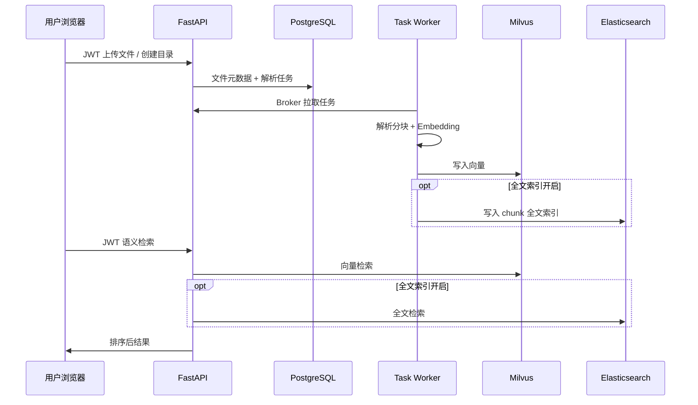

# OpenRag 项目说明

> 运维与使用说明共四份：`01` 本文件、`02-Kubernetes部署.md`、`03-使用说明.md`、`04-外部系统接入与API.md`。若需要单独成篇的 **方案 / 技术 / 亮点** 叙述（偏评审与对外介绍），见 [项目方案与技术概述.md](./项目方案与技术概述.md)。

## 定位

OpenRag 面向团队与企业的知识库场景：在工作区内以 **统一逻辑路径（`/` 开头的虚拟文件目录）** 管理文档；解析后除细粒度 **L2 切片向量** 外，还构建 **目录/文档级 L0、L1 摘要向量** 以支持 **由粗到细的分层检索**；可选 **Elasticsearch BM25 独立召回** 与 Dense 结果通过 **Weighted RRF** 做名次融合。人机接口分为 **用户 JWT** 与 **服务令牌（`/service/v1`）**。

## 主要功能

| 领域 | 能力 |
|------|------|
| 身份与组织 | 用户注册/登录、团队（Team）、工作区成员 |
| 文档与目录 | **虚拟逻辑目录**：文件/目录以 `parent_id` + **`uri`（工作区内绝对路径）** 建模；Web 与 API 提供嵌套树、子项列举；检索支持 **`path_prefix` 子树限定**（仅搜某目录逻辑子树） |
| 检索 | **平面向量检索**；**上下文/分层检索（L0→L1→L2）**：先在文档/目录摘要层粗筛候选文件，再在候选内搜切片，多阶段分数 **min-max 归一化后加权融合**；**混合检索**：在开启 ES 时由 Dense 与 BM25 在有限授权范围内独立召回，以 `vector_similarity_weight` 控制 Dense 通道贡献并使用 **Weighted RRF** 融合名次；可选 **Cross-Encoder 重排**、**检索意图路由**（`retrieval_strategy`）、**L1+LLM 切片导航**（见 OpenAPI `/search`） |
| 权限 | 工作区维度读写；**角色**聚合多工作区权限；用户可查看自身权限来源（「权限」页） |
| 机读集成 | 工作区级 **Service Token**（`sk-...`），`/service/v1` 下列目录、上传、语义检索（**完整 API 见 [04-外部系统接入与API.md](./04-外部系统接入与API.md)**） |
| 运维 | Docker Compose 一键栈（PostgreSQL、Milvus、ES、API、Nginx 前端、Task Worker）；本地开发见仓库根目录 `LOCAL_DEV_GUIDE.md` |

## 亮点

### 虚拟文件目录与数据模型

- 工作区内资源不是「散落对象」，而是 **一棵树**：目录与文件均有记录，通过 **`uri`（如 `/合同/2024/a.pdf`）** 表达层级，与物理存储路径解耦，便于权限、检索前缀与外部系统 **按路径集成**（`/service/v1` 的 `tree` / `children` / `path` 均基于此）。
- 上传、列表、检索共用同一套逻辑路径语义；检索请求中的 **`path_prefix`** 可做 **子树范围** 过滤（例如只在 `/法务/` 下搜）。

### 分层（递归式）检索管线

- 除 **L2 文档切片** 写入向量库外，系统为 **目录聚合与子文档摘要** 维护 **L0（粗粒度）/ L1（结构概览）** 等层级表示，并在 Milvus 的 **layer 集合** 中索引；解析完成后会 **沿父目录向上传播** 更新祖先目录的层次摘要（见 `openrag.hierarchy`）。
- 开启 **上下文检索**（`use_contextual_retrieval`）时，检索路径为：**L0 向量粗筛候选文件 → L1 在候选上细化 → 仅在候选文件集合内对 L2 切片做向量检索**，再对多阶段分数做 **归一化与固定权重融合（0.2 / 0.3 / 0.5）**，等价于在目录—文档—切片之间 **由粗到细「递归收窄」** 检索空间，大库场景下更稳、更可解释。
- 支持 **`retrieval_strategy`**（如 `auto|light|deep|precise|flat`）做意图/深度路由；可选 **L1 + LLM** 在候选内挑选切片子集（`use_l1_llm_navigation`，需配置大模型密钥）。
- Layer 集合不可用时 **自动退化为平面 L2 检索**，不阻塞服务。

### 混合检索（稠密 + 稀疏）

- 在 **`ELASTICSEARCH__ENABLED=true`** 且 ES 可用时，Dense 与 BM25 在同一有限授权文件范围内独立召回，按 `chunk_id` 求并集后使用 **Weighted RRF** 融合名次。
- `vector_similarity_weight` 表示 Dense 通道的名次贡献，Sparse 权重为 `1-weight`。`fused_score` 不是概率或相似度，不可跨查询比较；Flat 与 Contextual 都会在融合后执行 DB 权威校验。

### 其它工程能力

- **双通道鉴权**：人机走 JWT；机读走 `X-OpenRag-Token`，与 `/service/v1` 严格分离。
- **解析与 Broker**：**Task Worker** 拉取解析任务（非 Celery），易水平扩展。
- **可选重排序**：对向量命中可再走 Cross-Encoder 等 rerank（由 `use_rerank` 等控制，详见 OpenAPI）。
- **生产同源部署**：Nginx 静态页 + `/api/*` 反代，减少浏览器跨域负担。

## 主要业务流程

### 1. 用户侧：入库与检索

### 2. 外部系统：令牌与 `/service/v1`

1. 系统管理员在 Web **服务令牌**页为某一工作区创建令牌（`read` / `write`）。
2. 外部服务在每次请求中携带 `X-OpenRag-Token: sk-...`，URL 中使用该工作区的 **`name`（全局唯一展示名，需 URL 编码）**。
3. 读树、列子项、查元数据、检索使用 `read`；上传/覆盖需 `write`。

## 技术架构

| 层级 | 技术 |
|------|------|
| 前端 | React 18、TypeScript、Vite、Ant Design、React Router、i18next |
| API | Python 3.11、FastAPI、Pydantic Settings、SQLAlchemy、Alembic |
| 关系库 | PostgreSQL 16 |
| 任务协调 | PostgreSQL + Broker API（Task Worker HTTP 拉取） |
| 向量库 | Milvus（standalone），依赖 etcd + MinIO |
| 全文检索 | Elasticsearch 8.x（可选） |
| 对象存储 | MinIO（S3 兼容，`STORAGE_*` 配置） |
| 文档解析 Worker | 多进程 Python，`openrag.worker.task_worker`，可配置 PDF 后端等 |

### 部署视图（Docker Compose 生产）

- **web**：Nginx（静态资源 + `/api/` → `api:8000`）
- **api**：Uvicorn 监听容器内 `8000`；默认 **宿主机 8001** 映射到该端口
- **task-worker**：独立容器，需能访问与 API 相同的 DB / Milvus / ES

### 配置要点（摘录）

- 后端：数据库 `POSTGRES_*`、Milvus、`ELASTICSEARCH__*`、`STORAGE_*`、`SECRET_KEY`、Embedding 提供商密钥等（见 `openrag/.env.example` 与 `docker/.env.example`）。
- 前端：`web/.env` 中 `VITE_API_URL`（开发默认直连 `http://localhost:8001`，或使用 `/api` 走 Vite 代理）。

## 版本与演进

交互式契约以运行中服务的 **OpenAPI**（`/docs`）为准；设计草案与未完成项见 `docs/superpowers/` 与 `docs/openrag-unimplemented.md`。
