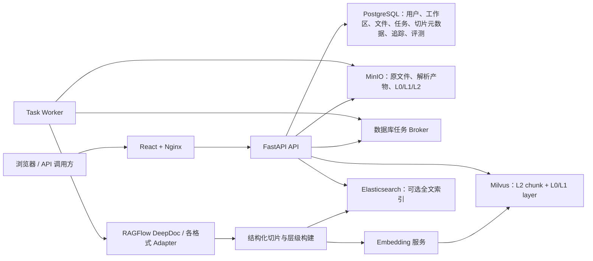
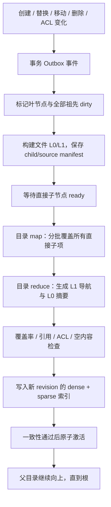
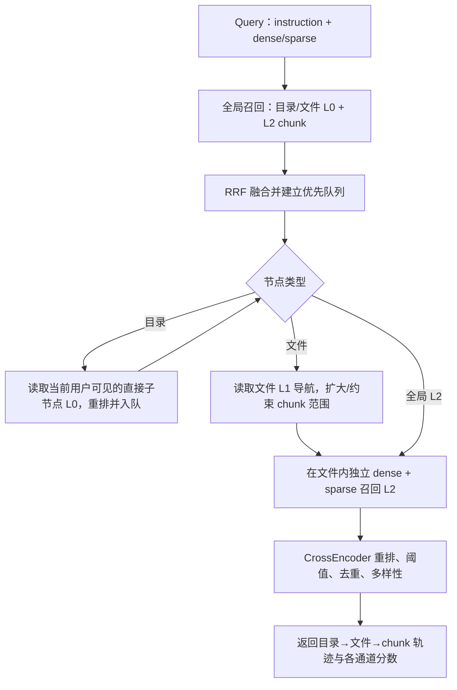

# OpenRag 架构风险与检索优化评审

> 评审日期：2026-07-10
> OpenRag 基线：`a13e3cb`（`main`）
> RAGFlow 对标基线：`D:\code\origin\ragflow` / `509ae6825`
> OpenViking 对标基线：`D:\code\origin\OpenViking` / `abda06f0`
> 最近进度回写：2026-07-17（A-01 代码实现与本地验收完成；待历史索引处置、真实业务评测和生产灰度）

## 0. 结论先行

OpenRag 已经具备一个企业知识库的主要骨架：工作区与团队、虚拟文件树、异步解析任务、RAGFlow DeepDoc 解析器、结构化切片、MinIO、PostgreSQL、Milvus、可选 Elasticsearch、L0/L1/L2 层级、检索追踪与离线评测、React 管理界面。项目不是“从零开始”，而是已经进入需要解决正确性、隔离性和工程闭环的阶段。

但以当前代码直接面向外网或多租户生产使用，风险不可接受。最需要优先阻断的是：

1. **检索权限解析异常时会退化成搜索全部文件**，存在跨工作区数据泄漏路径。
2. **文件级 ACL 目前只在权限管理接口中使用，未进入文件读取、列表、搜索等核心数据面**，产品宣称的细粒度权限与真实执行不一致。
3. **`/broker` 工作接口没有身份认证**，外部请求可领取任务、伪造心跳、触发恢复并读取任务载荷。
4. **Embedding 未配置或调用失败时静默写入确定性伪向量**，任务仍可成功，造成不可见的索引污染。
5. **Embedding 维度变化会直接删除 Milvus 集合并重建**，没有迁移、重建确认或原子切换。
6. **当前 OpenViking 衍生代码标注 AGPL-3.0，而 README 声称 Apache 2.0，仓库又缺少根 LICENSE/NOTICE**，商业分发前必须做开源合规审查。

检索准确率方面，当前最大的机会不在立刻引入 GraphRAG，而在修正基础召回链路：

- Elasticsearch 只给 Milvus 已召回的 chunk 打分，**不构成独立 BM25 召回**；应改为稠密与稀疏各自召回、候选求并集、RRF 融合、再交叉编码重排。
- 默认 Qwen3 Embedding 查询没有 instruction；官方模型卡明确建议 query 使用任务指令。
- 解析后的标题、完整逻辑路径、标题面包屑、表格/页码信息没有系统性进入向量文本与 BM25 权重字段。
- 当前目录 L0 只取按名称排序后的前 5 个子项，文件 L1 主要是正文开头截断，并不是真正摘要。
- “层级检索”是 L0 候选文件筛选后再搜 L2，不是 OpenViking 式目录递归；目录节点还会占用 L0 名额，却不能自然下钻到后代文件。

推荐顺序是：**先封堵权限与索引完整性风险 → 建立可复现实验集 → 补齐 RAGFlow 式知识库基本闭环 → 做真正独立混合召回和结构感知切片 → 再建设目录分层摘要与递归检索 → 最后按评测结果决定 RAPTOR、HyDE、ColBERT 等高级方案。**

---

## 1. 评审范围、方法与限制

本次审查覆盖：

- 根目录及 `docs/`、`openrag/README.md` 中的架构、部署、存储、缺陷说明。
- `openrag/src/openrag` 下 API、权限、任务、解析、切片、Embedding、Milvus、Elasticsearch、层级摘要、检索、重排、追踪和评测代码。
- `web/src` 中知识库、文件、搜索和相关 API 类型。
- Docker、Docker Compose、Kubernetes 清单和依赖声明。
- 本地 RAGFlow 与 OpenViking 的代码、文档和许可证。
- 公开的一手资料：模型官方说明、论文、OWASP 指南。

本次没有进行渗透测试、真实多租户攻击演练、大规模性能压测、模型在线 A/B 或生产数据抽样，因此风险等级基于代码可达性与影响判断；准确率收益是技术建议，不是未经验证的收益承诺。

评审时工作区已有未提交改动：

- `openrag/tests/test_files_api.py`
- `web/src/components/FileList.test.tsx`
- `web/src/services/api.test.ts`
- `web/src/components/FileUpload.test.tsx`（未跟踪）

这些改动没有被修改，也没有计入已提交主干能力；涉及它们的测试失败在第 8 节单独说明。

风险等级定义：

- **P0 / 阻断上线**：可导致跨租户泄漏、索引/数据破坏、核心认证绕过或重大合规问题。
- **P1 / 高危**：高概率导致安全、任务、索引一致性或生产可用性问题。
- **P2 / 中危**：会积累技术债、降低可观测性、稳定性或质量，但通常不会立即造成灾难性后果。

---

## 2. 当前架构与主要功能

### 2.1 运行架构

核心数据流是：上传文件 → MinIO → PostgreSQL 建任务 → Worker 拉取 → 解析为 `DocumentBlock` → 按文档类型切片 → 生成 L0/L1/L2 → Embedding → Milvus/Elasticsearch → 写回文件状态与 chunk 元数据。

### 2.2 已有主要功能

| 领域 | 当前能力 |
|---|---|
| 身份与租户 | 用户注册/登录、JWT、服务令牌、工作区、团队、角色、工作区成员 |
| 文件与知识库 | 上传、目录、虚拟路径、移动、删除/软删除、标签、预览、分享链接、重新处理 |
| 文档解析 | PDF、DOC/DOCX、PPT、Excel、Markdown、HTML、JSON、CSV、EPUB、TXT；集成 RAGFlow 解析组件和 PaddleOCR/MinerU 等入口 |
| 切片 | general/manual/laws 等 profile，保存页码、bbox、block type、源字符位置等信息 |
| 层级 | 文档 L0 摘要、L1 概览、L2 chunk；目录 L0/L1 聚合；MinIO/本地层级产物；Milvus layer 集合 |
| 检索 | Milvus 向量检索、可选 ES 分数混合、固定 L0/L1/L2 融合、规则化 query intent、可选 L1 LLM 过滤、CrossEncoder/DashScope 重排 |
| 可观测性 | Trace、阶段快照、检索配置快照、评测数据集、人工/业务/LLM judgment、Precision/Recall/HitRate/MRR/MAP/nDCG、评测运行对比 |
| 部署 | Docker/Compose、Kubernetes、API/Worker/Web 镜像，PostgreSQL、etcd、MinIO、Milvus、Elasticsearch |

### 2.3 文档与代码存在漂移

部分历史文档仍写着“reranker 是 mock”“DocumentBlock 未持久化”“前端搜索页缺失”等，但当前代码已经实现本地/API reranker、解析产物与 chunk 元数据持久化、搜索页和评测服务。后续决策应以代码为准，并把文档维护纳入发布门禁，否则团队会基于过期假设做重复工作或错误验收。

---

## 3. 风险与高危点

### 3.1 P0：必须在生产外放前解决

#### R-01 权限解析异常时“fail open”搜索全部文件

**状态（2026-07-15）**：优化已完成，独立复审通过。权限范围解析已改为 fail-closed，异常统一返回脱敏 `503`，且受限检索命中会在 Trace 和数据库回表前执行授权反向校验。实施、测试与审查记录见 [R-01 权限解析 Fail-Open 修复方案](./R-01权限解析Fail-Open修复方案.md)。

**原始评审证据**：[`retrieval_service.py`](../openrag/src/openrag/retrieval/retrieval_service.py#L708) 的 `_accessible_file_ids()` 在解析权限发生异常时记录 “searching all files” 并返回 `None`；`None` 在后续表示不加文件过滤。

**影响**：数据库短暂异常、坏数据、代码回归或意外类型错误，都可能从“本次搜索失败”放大成“跨工作区检索”。这是典型的租户数据泄漏路径。

**建议**：任何无法证明访问范围的情况都返回空集合或 403/503；同时在 Milvus、ES 和 PostgreSQL 回表三个层面保留同一授权条件。增加故障注入测试：权限数据库超时、成员记录损坏、Workspace 不存在时，结果必须为 0，不能回退到全局搜索。OWASP 对 RAG 授权的建议同样要求索引和检索路径 fail closed，并防止 chunk 跨租户暴露（[OWASP RAG Security Cheat Sheet](https://cheatsheetseries.owasp.org/cheatsheets/RAG_Security_Cheat_Sheet.html)）。

#### R-02 文件级 ACL 未进入实际数据面

**状态（2026-07-15）**：已完成。`code-optimization` 已完成旧文件 ACL API、服务、ORM、受零记录保护的数据库迁移以及发布验收状态标记；文件访问权限模型收敛为工作区 RBAC。执行方案与验收记录见 [R-02 文件级 ACL 下线方案](./R-02文件级ACL下线方案.md)。

**原始评审证据**：[`permission_manager.py`](../openrag/src/openrag/services/permission_manager.py#L142) 实现了用户/团队文件权限及父级继承，但代码引用显示它主要只由 [`permissions_api.py`](../openrag/src/openrag/api/permissions_api.py#L77) 调用；文件读取、移动、删除、Workspace 文件访问、分享和搜索则调用 [`workspace_service.py`](../openrag/src/openrag/services/workspace_service.py#L140) 的工作区级权限。例如文件读取位于 [`files_api.py`](../openrag/src/openrag/api/files_api.py#L598)，搜索 Workspace 检查位于 [`search_api.py`](../openrag/src/openrag/api/search_api.py#L248)。该段保留评审基线事实；其中待删除文件在当前分支可能已不存在。

**影响**：管理员配置的文件 ACL 可能只被保存和展示，却不能收紧实际访问；“拥有工作区 read”实际等价于读取工作区全部文件。对外宣称的细粒度权限不成立，也会污染目录摘要——不可见子文件内容可能被汇总进可见父目录。

**建议**：只保留一个授权决策服务，定义清楚 deny/allow、继承、owner、workspace role、team 和 service token 的优先级；所有“按 ID 读取对象”的接口做对象级授权，所有检索索引写入安全域字段，所有召回通道使用同一 `effective_file_ids/security_cohort`。这属于 OWASP API1:2023 Broken Object Level Authorization 的直接治理范围（[OWASP API Security](https://owasp.org/API-Security/editions/2023/en/0xa1-broken-object-level-authorization/)）。

#### R-03 Worker Broker 接口无认证

**证据**：[`broker_api.py`](../openrag/src/openrag/api/broker_api.py#L58) 的 `get-tasks`、[`heartbeat`](../openrag/src/openrag/api/broker_api.py#L89)、[`recover-timeout`](../openrag/src/openrag/api/broker_api.py#L115) 和 `weights` 只有数据库依赖，没有 JWT、服务令牌或 Worker 身份依赖；路由在 [`main.py`](../openrag/src/openrag/api/main.py#L220) 直接挂载。

**影响**：攻击者可以领取任务导致真实 Worker 无法处理，读取任务的 payload/result/error，伪造心跳让任务永不恢复，或反复触发恢复造成重复处理和资源消耗。

**建议**：Broker 不应暴露在公共 Web 路由；至少使用专用短期 Worker 凭据、mTLS/内网 NetworkPolicy、Worker ID 与凭据绑定、请求签名/重放防护。领取、心跳、完成必须校验“任务归属当前 Worker”，并记录审计日志。

#### R-04 Embedding 失败静默写入伪向量

**证据**：[`embedding_engine.py`](../openrag/src/openrag/embedding/embedding_engine.py#L45) 在无 API key 时启用 mock；单条和批量 API 异常也在 [`embedding_engine.py`](../openrag/src/openrag/embedding/embedding_engine.py#L113) 与 [`embedding_engine.py`](../openrag/src/openrag/embedding/embedding_engine.py#L158) 回落为 SHA-256 派生的伪向量。文档处理随后仍会完成。

**影响**：Embedding 服务故障不会形成明确失败，而是污染生产索引；查询端如果使用真实向量，结果近似随机；如果前后都 mock，看似“能搜”但语义完全失真。真实与伪向量还可能在同一集合混用。

**建议**：mock 只能通过显式 `TEST_MODE` 在测试进程启用；生产启动时验证模型、维度和探针向量。任何 embedding 失败必须让当前 generation 失败并可重试，禁止激活部分索引。监控必须区分 provider、model revision、维度、成功率、空向量和降级状态。

#### R-05 维度变化直接删除 Milvus 集合

**证据**：[`milvus_store.py`](../openrag/src/openrag/vectorstore/milvus_store.py#L99) 和 [`milvus_layer_store.py`](../openrag/src/openrag/vectorstore/milvus_layer_store.py#L59) 发现已有维度与配置不一致时直接 `drop()` 集合。

**影响**：一次配置错误或模型切换即可删除全量 chunk/L0/L1 向量。API 或 Worker 启动都可能触发，且没有二次确认、备份、重建进度或回滚。

**建议**：集合名包含不可变 `index_version/model_revision/dimension`；新版本旁路构建并通过数量、一致性和评测门禁后原子切换 alias。旧集合保留回滚窗口，删除只能由显式运维命令完成。

#### R-06 OpenViking 衍生代码的许可证边界不清

**证据**：OpenRag README 声称 Apache 2.0，但仓库根和 `openrag/` 下未发现 LICENSE/NOTICE；[`hierarchy/utils.py`](../openrag/src/openrag/hierarchy/utils.py#L4) 标明 “Adapted from OpenViking / AGPL-3.0”，[`document_hierarchy_builder.py`](../openrag/src/openrag/hierarchy/document_hierarchy_builder.py#L9) 也标注 AGPL-3.0。被对标的本地 OpenViking 根许可证为 GNU AGPL-3.0；RAGFlow 为 Apache 2.0。

**影响**：如果相关代码构成 AGPL 衍生作品，网络服务和分发可能触发源代码提供义务，与项目宣称许可证和商业策略冲突。

**建议**：在继续发布前由法务/开源合规负责人确认代码来源、提交历史和衍生边界；补齐 LICENSE、NOTICE、第三方组件清单、原始版权声明和 SBOM。若不能接受 AGPL，按功能规格进行 clean-room 重写，不能简单删除文件头。本文不是法律意见。

### 3.2 P1：高危与高概率生产问题

| ID | 风险 | 代码证据与影响 | 建议 |
|---|---|---|---|
| R-07 | 服务令牌明文存储且可再次取回 | [`service_token.py`](../openrag/src/openrag/models/service_token.py#L22) 明确写着 plaintext；[`service_tokens_admin.py`](../openrag/src/openrag/api/service_tokens_admin.py#L303) 可返回完整 secret。数据库泄漏将直接暴露全部长期机器凭据。 | secret 仅创建时显示一次；库内保存带 pepper 的 HMAC/哈希，使用公开 prefix 定位；增加过期、轮换、last-used、用途、IP/客户端约束和审计。参考 [OWASP Secrets Management](https://cheatsheetseries.owasp.org/cheatsheets/Secrets_Management_Cheat_Sheet.html)。 |
| R-08 | 开放注册、密码最短 1 位、JWT 默认密钥与 12 小时时效 | [`users_api.py`](../openrag/src/openrag/api/users_api.py#L23)、[`security.py`](../openrag/src/openrag/security.py#L15)、[`config.py`](../openrag/src/openrag/config.py#L121)。没有看到登录/注册速率限制、锁定或 MFA。 | 生产默认关闭自助注册；启动拒绝默认 secret；密码/SSO/MFA 策略、速率限制、失败锁定、短 access token + refresh rotation。 |
| R-09 | 分享链接权限和计数并发控制偏弱 | [`share_api.py`](../openrag/src/openrag/api/share_api.py#L72) 只需 workspace read 即可创建外链；[`share_manager.py`](../openrag/src/openrag/services/share_manager.py#L154) 先检查再递增，非原子，可能并发突破 `max_access_count`。 | 分享要求 file owner/admin 或独立 share 权限；原子 `UPDATE ... WHERE access_count < max`；短期、可撤销、审计、下载水印/风险提示。 |
| R-10 | 不可信文件解析缺乏隔离与资源预算 | 上传上限 100 MB，但 [`file_ingest.py`](../openrag/src/openrag/services/file_ingest.py#L26) 的类型主要来自 Content-Type/扩展名；API 在 [`files_api.py`](../openrag/src/openrag/api/files_api.py#L388) 一次性读入内存。未发现魔数校验、恶意文件扫描、页数/解压比/解析 CPU/内存预算。 | 流式上传、魔数与扩展双校验、AV/CDR、压缩炸弹与页数限制；解析 Worker 放入无网络、只读根文件系统、低权限、seccomp/AppArmor、CPU/内存/时间配额。参考 [OWASP File Upload](https://cheatsheetseries.owasp.org/cheatsheets/File_Upload_Cheat_Sheet.html) 与 [OWASP Unrestricted Resource Consumption](https://owasp.org/API-Security/editions/2023/en/0xa4-unrestricted-resource-consumption/)。 |
| R-11 | 多存储索引写入不是原子 generation | [`document_processor.py`](../openrag/src/openrag/processors/document_processor.py#L552) 先删除旧 Milvus，再依次写 Milvus、ES、layer、MinIO、PostgreSQL；ES/layer 失败只 warning，文件仍在 [`document_processor.py`](../openrag/src/openrag/processors/document_processor.py#L829) 标记 completed。 | 每次处理创建 generation；所有产物带 generation ID，完成一致性校验后原子激活。使用 outbox/retry/reconciliation，状态至少区分 parsed/vectorized/fulltext/layers/active/degraded。 |
| R-12 | 超时任务定时恢复实际上未提交事务 | [`task_broker.py`](../openrag/src/openrag/broker/task_broker.py#L91) 的 `recover_timeout_tasks()` 只执行 UPDATE 不 commit；[`scheduler.py`](../openrag/src/openrag/scheduler.py#L38) 调用后直接关闭 session，手工恢复接口亦无 commit。因此定时恢复和手工恢复很可能回滚。 | 在服务方法内明确事务边界并测试“无待领取任务时也能持久恢复”；使用数据库时间、幂等 lease token 和 fencing token 防止旧 Worker 继续提交。 |
| R-13 | Broker 的“动态权重”不跨请求持久 | [`broker_api.py`](../openrag/src/openrag/api/broker_api.py#L53) 每次请求创建新 `TaskBroker`，而权重保存在实例内字典 [`task_broker.py`](../openrag/src/openrag/broker/task_broker.py#L33)。衰减结果请求结束即丢失。 | 将公平调度状态放入 PostgreSQL/Redis，或简化为可证明的 SQL 公平队列；不要维护看似动态、实际瞬时的权重。 |
| R-14 | 健康检查与启动行为会掩盖不可用 | [`main.py`](../openrag/src/openrag/api/main.py#L176) 只检查 DB；启动 DB/调度器失败仅打印后继续；通用异常处理器在 [`main.py`](../openrag/src/openrag/api/main.py#L154) 不记录堆栈。 | 分离 liveness/readiness；readiness 检查 DB、MinIO、Milvus、Embedding、可选 ES、Worker 新鲜度和 schema/index version；启动必要依赖失败应退出，异常必须结构化记录 trace ID。 |
| R-15 | 数据库以 `create_all` 代替完整迁移治理 | [`database.py`](../openrag/src/openrag/database.py#L62) 启动执行 `Base.metadata.create_all()`，只能建缺失对象，不能安全演进已有列、约束与回填。 | 生产只运行版本化 Alembic 迁移；支持 expand/migrate/contract、前后兼容和回滚演练，API 启动只校验 schema version。 |
| R-16 | K8s 关键组件全部单副本且缺少网络/Pod 安全策略 | PostgreSQL、etcd、MinIO、Milvus、ES、API、Worker、Web 清单均为 `replicas: 1`；只看到 ES 的局部 `securityContext`，未发现 NetworkPolicy、PDB、HPA 或自动备份 CronJob。 | 明确单机版与生产版；生产采用托管/HA 数据服务、备份恢复演练、PDB/HPA/反亲和、NetworkPolicy、容器 securityContext、资源配额。 |
| R-17 | “物理隔离”表述与可配置实现不完全一致 | 默认可为每个 workspace 使用 bucket，但 [`minio_storage.py`](../openrag/src/openrag/storage/minio_storage.py#L83) 也支持单物理 bucket + prefix；Milvus chunk/layer 又是全局集合，以 file_id 逻辑过滤。 | 文档准确区分物理隔离、逻辑命名空间和应用层过滤；高敏租户考虑独立 bucket/KMS key/collection 或独立实例，不应只靠应用过滤。 |
| R-18 | 依赖存在已知漏洞且版本治理偏松 | 2026-07-10 执行 `npm audit --omit=dev`：2 high、4 moderate；当前安装包括 axios 1.14.0、form-data 4.0.5、react-router-dom 6.30.3、DOMPurify 3.3.3。很多 Python 依赖用 `>=`，基础镜像未固定 digest。 | 先结合浏览器/Node 实际调用面判断可利用性，再升级到修复版本；CI 增加 lock、SBOM、签名、SCA、镜像扫描和变更审批。相关公告见 [axios GHSA-pmwg-cvhr-8vh7](https://github.com/advisories/GHSA-pmwg-cvhr-8vh7)、[form-data GHSA-hmw2-7cc7-3qxx](https://github.com/advisories/GHSA-hmw2-7cc7-3qxx)。 |

### 3.3 P2：中期治理项

- API 文档 `/docs`、`/redoc`、`/openapi.json` 永久开放；生产应按管理网络或配置开关控制。
- API 每个进程都启动调度器；多副本时会重复扫描，即便修复 commit，也应改为单独 scheduler/leader election。
- Move 操作只移动当前文件及其 hierarchy 对象，不重建旧父目录和新父目录摘要；Delete 同样没有祖先重算。
- ES 重处理时新 chunk upsert 前未显式按 file 删除旧 chunk，虽然当前 ES 只对 Milvus 候选打分使旧文档难以命中，但会形成索引垃圾和一致性债务。
- 大量配置仍通过环境变量直接散落读取，未形成可记录、可校验、可关联到 index generation 的配置快照。
- README 使用“企业级”“严密权限”“物理隔离”等强承诺，和上述代码事实有差距，属于交付与合规风险。

---

## 4. 检索准确率：当前问题与优化建议

### 4.1 当前检索链路的关键缺陷

#### A-01 当前不是独立的 Hybrid Recall

**状态（2026-07-17）**：代码实现与本地验收已完成，当前处于“待历史索引处置、真实业务质量/性能验收和生产灰度”状态。实现位于 `accuracy-fix` 工作区，目前仍是未提交、未合入 `code-optimization` 的工作区改动。

已完成的工作：

1. 已确认根因：`_blend_elasticsearch_scores()` 把 Dense 已召回的 `chunk_ids` 传给 ES，导致 ES 只能在 Dense 候选内打分，不能形成独立 Sparse 召回。
2. 已实现目标链路：新增 ES `search_chunks()` 独立 Sparse 召回 Adapter 和纯函数 `weighted_rrf()`；Milvus Dense 与 ES BM25 在同一授权文件范围内独立召回，按 `chunk_id` 求并集和 Weighted RRF 融合。Flat 与 Contextual 两条链路均已接入，Sparse 不再受 Dense 的 L0 文件候选或 L2 chunk 候选限制。
3. 已实现权限和数据权威边界：新增显式 `ResolvedFileScope` 与 `PermissionScopeResolutionError`，权限解析异常 fail-closed；融合候选统一通过 `DocumentChunk`、`File.deleted_at`、工作区归属和授权文件范围校验，并消除原 `_enrich_hits()` 的 File N+1 查询。
4. 已实现 ES 写一致性和降级：文件重新处理时先执行 ES `delete_by_file_id` 再 bulk upsert，并校验完整写入数量；ES 禁用或异常时保留 Dense 结果并记录 Sparse 降级原因。`fused_score` 与真正的 `reranked_score` 已分离。
5. 已实现 Trace、评测、灰度和兼容层：新增 Dense/Sparse/Weighted RRF/DB 校验阶段统计，保留 `legacy | independent_rrf` 切换且当前默认仍为 `legacy`；API 字段名保持兼容，前端和文档已同步新的“向量通道权重”语义。
6. 已完成本地自动化验收：A-01 后端目标矩阵 81/81 通过，仓库默认后端测试集 177/177 通过；前端 `Search.test.tsx` 5 个用例通过，`npm run build` 成功。
7. 已完成真实依赖隔离验收：使用独立 PostgreSQL 测试数据、Milvus collection 和 ES index，验证 Dense Top-2 未包含目标 chunk 时，独立混合召回最终 Top-2 能包含该 Sparse-only chunk；隔离测试资源已清理。
8. 已执行历史 ES 只读一致性审计：本地 6 个工作区中，1 个空工作区零异常，其余 5 个工作区的 ES index 不存在，共报告 1060 个 `missing_es_chunk`；审计未创建索引、清理或重建，报告不包含 chunk 正文。

需要定向重处理或回填的 5 个工作区如下：

| 工作区 ID | 审计对应的 ES 索引 | DB 有效 chunk | ES 文档 | `missing_es_chunk` | 审计报告 |
|---:|---|---:|---:|---:|---|
| 1 | `openrag_ws_my-test_chunks` | 344 | 0 | 344 | `workspace-1.json` |
| 2 | `openrag_ws_module4-1780063527501_chunks` | 28 | 0 | 28 | `workspace-2.json` |
| 4 | `openrag_ws_module9-e2e-1780074262561_chunks` | 678 | 0 | 678 | `workspace-4.json` |
| 5 | `openrag_ws_module9-e2e-1780074309051_chunks` | 1 | 0 | 1 | `workspace-5.json` |
| 23 | `openrag_ws_upsert-test-ws_chunks` | 9 | 0 | 9 | `workspace-23.json` |
| **合计** | — | **1060** | **0** | **1060** | — |

工作区 3（索引名 `openrag_ws_module4-other-1780063527501_chunks`）的 DB 有效 chunk 为 0，审计异常数为 0，因此不在本次重处理或回填范围内。完整报告位于 `E:\project\OpenRag\.worktrees\accuracy-fix\docs\a01-es-audit-local\`。

方案产物位于 `accuracy-fix` 工作区：

- `E:\project\OpenRag\.worktrees\accuracy-fix\docs\2026-07-16-A01独立混合召回修复方案.md`
- `E:\project\OpenRag\.worktrees\accuracy-fix\docs\2026-07-16-A01独立混合召回执行计划.md`

尚未完成的发布门槛：

1. 对工作区 ID `1、2、4、5、23` 执行定向重处理或回填，并复审 1060 个 `missing_es_chunk` 归零；工作区 3 无有效 chunk，不需要处理。
2. 在真实业务标注集上完成 exact/semantic 分类评测，确认召回、排序质量和 p95 延迟满足门槛。
3. 将 `accuracy-fix` 与 `code-optimization` 已完成的 R-01 等改动做冲突与语义复审，避免两套权限范围实现分叉。
4. 完成生产灰度观察后再把 `independent_rrf` 设为默认；观察期结束且指标稳定后删除 legacy `_blend_elasticsearch_scores()` 和 `search_chunk_scores()`。

[`retrieval_service.py`](../openrag/src/openrag/retrieval/retrieval_service.py#L228) 先从 Milvus 得到候选；随后 `_blend_elasticsearch_scores()` 将这些 `chunk_ids` 传给 [`es_chunk_store.py`](../openrag/src/openrag/search/es_chunk_store.py#L103)，ES 查询又包含 `ids` 限制。结果是 BM25 只能重打分向量已经召回的 chunk，不能救回向量漏掉但关键词精确命中的内容。

**推荐**：

1. Dense 独立召回 `N_dense`。
2. BM25/稀疏独立召回 `N_sparse`。
3. 按 chunk 稳定 ID 求并集。
4. 先用 Reciprocal Rank Fusion（RRF）融合；它对异构分数不要求人工归一化，原始方法见 [Cormack et al., 2009](https://plg.uwaterloo.ca/~gvcormac/cormacksigir09-rrf.pdf)。
5. 对融合后的 50～200 个候选做 cross-encoder rerank，再做文档去重/多样性与阈值过滤。

RAGFlow 当前代码正是把全文 `matchText`、稠密 `matchDense` 和 `FusionExpr` 同时交给存储层，而不是先用 dense 限死 lexical 候选。BEIR 也说明 BM25 是跨领域非常强的零样本基线，而重排/late interaction 往往在平均效果上更强但成本更高（[BEIR](https://arxiv.org/abs/2104.08663)）。

#### A-02 ES 字段和中文检索信号没有真正用起来

[`es_chunk_store.py`](../openrag/src/openrag/search/es_chunk_store.py#L117) 的查询基本只搜 `content`；Worker 虽写入 `content_ltks`、`content_sm_ltks`、`content_with_weight`、`mom_with_weight`、`doc_type` 等字段，但当前查询与显式 mapping 没有利用这些信号。

**推荐**：建立受版本管理的 mapping，并独立索引：

- `title/path/heading_breadcrumb/keywords/questions`：较高权重；
- `body/table/caption`：主体权重；
- `exact_terms`：编号、合同号、产品名、代码符号，keyword/精确检索；
- 中文分词字段与字符 n-gram/小粒度 token 字段；
- workspace、ACL cohort、file、doc type、日期、标签等 keyword/filter 字段。

不要继续依赖 Elasticsearch 动态 mapping 猜测类型。字段、分词器、权重和索引版本都应进入评测快照。

#### A-03 Qwen3 查询缺少 instruction

项目默认 `Qwen3-Embedding-4B`，但 [`embedding_engine.py`](../openrag/src/openrag/embedding/embedding_engine.py#L113) 对 query 和 document 都直接发送原文。Qwen 官方模型卡说明 query 应带一条任务 instruction，而 document 不需要；定制 instruction 通常还能带来约 1%～5% 提升（[Qwen3-Embedding-4B 官方模型卡](https://huggingface.co/Qwen/Qwen3-Embedding-4B)、[官方仓库](https://github.com/QwenLM/Qwen3-Embedding)）。

**推荐**：按语言和任务设置稳定 instruction，例如“Given a Chinese enterprise knowledge-base query, retrieve passages that answer it”；instruction 模板、模型 revision 和归一化方式必须跟 index/query 配置一起版本化。先在自有评测集验证，不要照搬英文公开榜单。

#### A-04 模型版本没有进入索引身份

Milvus schema 只有向量维度，没有 model provider、model revision、instruction、normalization、chunker/parser version；同维度模型升级也会把不兼容向量混在一起。

**推荐**：把以下组合作为不可变 `index_version`：

`parser_version + chunker_version + embedding_provider + model_revision + dimension + query_instruction_version + vector_normalization + fulltext_mapping_version + summary_prompt_version`

文件与 chunk 记录当前 active generation；任何配置变化都旁路重建，不原地混写。

#### A-05 层级检索不是真正的目录递归

[`retrieval_service.py`](../openrag/src/openrag/retrieval/retrieval_service.py#L365) 从 L0 命中抽取 `file_id`，把它们当候选文件，再在这些 ID 上搜 L2。目录自身也被写入 layer 集合，但目录 ID 没有 L2 chunk，因此目录命中会占用 L0 名额，却不能自然扩展到后代文件。L1 只是给 L0 候选增加分数，没有产生新的候选。

此外：

- contextual 分支使用固定 `0.2/0.3/0.5`，对当前候选集做 min-max；候选变化会改变分数含义。
- contextual 分支没有进入 [`search_api.py`](../openrag/src/openrag/api/search_api.py#L324) 中只属于 flat 分支的 CrossEncoder rerank，但返回值可能仍被标记为 reranked。
- 大于 512 个 file ID 时，[`milvus_store.py`](../openrag/src/openrag/vectorstore/milvus_store.py#L244) 采用全局 oversample 后内存过滤，上限 4096；其他租户/范围外结果可能挤掉范围内候选。

**推荐**：目录节点和文件节点分型；命中目录必须进入优先队列下钻，不得直接作为“候选文件”。层级融合先用 RRF/排名传播，固定线性权重必须由离线数据校准。租户/ACL 范围必须在服务端 ANN 过滤、partition key、namespace 或独立 collection 中完成，不能依赖全局 top-N 后过滤。

#### A-06 解析结构和源顺序损失

- PDF text block 的 heading level 基本为 0，表格在文本之后追加。
- DOCX 先遍历全部 paragraphs，再追加全部 tables，丢失段落与表格原始交错顺序（[`docx_adapter.py`](../openrag/src/openrag/parsers/adapters/docx_adapter.py#L188)）。
- Markdown 先处理 remainder，再追加全部 tables（[`markdown_adapter.py`](../openrag/src/openrag/parsers/adapters/markdown_adapter.py#L20)）。
- general profile 没有系统消费解析器产出的 heading/section 结构；表格与标题、caption、上下段落关系弱。
- chunk token 估算存在 `len(text)//4` 回退，对中文不可靠；层级摘要的句子切分主要识别英文 `.?!`。

**推荐**：统一建立按源顺序排列的 block stream，保留 `heading_path/section_id/parent_block_id/table_caption/page/bbox/char_span`；切片时按标题子树、段落和表格语义边界组合，超长再 token-aware 拆分。表格应生成“表名 + 表头 + 行/区域 + 所属章节”的可检索文本，同时保留原表用于引用。

#### A-07 层级摘要是截断，不是摘要

[`document_hierarchy_builder.py`](../openrag/src/openrag/hierarchy/document_hierarchy_builder.py#L68) 的 L1 narrative 主要取全文开头并截断，非标题文档最多列前 50 个 chunk；L0 再取 L1 各段第一句。目录 L0 在 [`directory_hierarchy_manager.py`](../openrag/src/openrag/hierarchy/directory_hierarchy_manager.py#L55) 只拼接前 5 个子摘要，且父传播前对子项按名称排序，因此内容偏向字典序靠前文件。

**推荐**：文件摘要要覆盖全篇结构；目录摘要必须覆盖所有直接子项，通过 map-reduce/batch merge 控制 token，而不是丢弃第 6 个以后子项。摘要需要 child manifest 和可追溯 child ID，支持覆盖率与忠实度检查。

#### A-08 重排降级与阈值策略不足

Reranker API 失败会尝试本地模型；本地也失败后退化为空白分词关键词重合。对不含空格的中文 query，降级分数经常失效；当前还叠加“前页加分”和 bbox 面积等启发式，未见基于评测校准。SearchRequest 没有明确的最低相关性/拒答阈值，因此总会返回 top-k，即使全部无关。

**推荐**：降级必须显式暴露 `reranker_state=healthy/degraded/disabled`，中文 fallback 至少使用与 BM25 一致的 tokenizer；建立 per-index 的相似度/重排阈值和 no-answer 校准。不要用固定页码偏好替代相关性。

### 4.2 建议的准确率优化优先级

| 优先级 | 优化项 | 为什么先做 | 验收方式 |
|---|---|---|---|
| A0 | Embedding fail-hard、模型/索引版本化、稳定 chunk ID、原子 generation | 先保证评测对象没有被静默污染 | 故障注入后旧索引仍可用；新 generation 不完整不得激活 |
| A0 | 独立 Dense + BM25 召回，RRF 融合 | 修复当前最明显的 recall 上限 | exact/编号类与语义类查询的 Recall@50、nDCG@10 均不回退 |
| A0 | ACL 在所有召回通道统一前置 | 准确率不能以泄漏为代价 | 跨租户/团队/继承/删除测试结果始终为 0 |
| A1 | 标题、路径、heading breadcrumb、关键词、表格上下文进入索引 | 低成本补充 chunk 丢失的局部语境 | 按 query type 对比 Recall@20、MRR@10 |
| A1 | Qwen query instruction | 与当前默认模型高度匹配、改动面小 | 自有中文集 A/B，记录模型 revision 与 instruction |
| A1 | 50～200 候选 CrossEncoder rerank + 阈值/去重/多样性 | 提升 top-k 排序和回答上下文质量 | nDCG@10、MRR、no-answer precision、p95 延迟 |
| A1 | 结构感知切片、源顺序与表格语义 | 解决答案被切断、表头丢失、章节错配 | 表格/法规/手册/跨页 PDF 专项集 |
| A2 | Contextual Retrieval：为 chunk 生成短上下文前缀后再 embedding/BM25 | 让局部 chunk 携带文档与章节语境 | 对比原始 chunk 与 contextual chunk；参考 [Anthropic Contextual Retrieval](https://www.anthropic.com/engineering/contextual-retrieval) |
| A2 | Multi-query、同义词/缩写/实体规范化 | 提升表达差异和企业术语召回 | 只对低置信或复杂 query 触发，控制重复与成本 |
| A2 | HyDE 作为可选路由 | 对短、抽象 query 可能有效，但会引入幻觉式查询偏移 | 只在专项集胜出才启用；参考 [HyDE](https://arxiv.org/abs/2212.10496) |
| A3 | Late Chunking / 长上下文 embedding | 可保留跨 chunk 上下文，但重建与显存成本高 | 大文档专项 PoC；参考 [Late Chunking](https://arxiv.org/abs/2409.04701) |
| A3 | BGE-M3 sparse+dense、多向量/ColBERTv2 | 可能提升多语言和细粒度匹配，但基础设施更复杂 | 与现有 Qwen+BM25+reranker 同预算对比；参考 [BGE-M3](https://arxiv.org/abs/2402.03216)、[ColBERTv2](https://arxiv.org/abs/2112.01488) |
| A3 | RAPTOR / Dynamic RAPTOR | 适合长文档与多跳全局问题，不应替代目录层级 | 仅在长文档、多跳集上验证；参考 [RAPTOR](https://arxiv.org/abs/2401.18059)、[Dynamic RAPTOR](https://arxiv.org/abs/2410.01736) |

> 不建议把所有策略同时打开。每项都应成为一个可复现的实验变量；模型榜单只用于候选筛选，最终以企业自有语料、中文查询和权限场景为准。多语言模型可参考 [MMTEB](https://arxiv.org/abs/2502.13595)，但公开 benchmark 不能替代内部评测。

---

## 5. 对标 RAGFlow：知识库基本能力差距

RAGFlow 值得借鉴的是“知识库产品闭环”和“检索信号工程”，而不是把所有高级功能一次性复制过来。

| 能力维度 | RAGFlow 当前能力 | OpenRag 当前状态 | 建议优先级 |
|---|---|---|---|
| 知识库级配置 | language、embedding model、默认 parser/chunker、similarity threshold、vector weight、pagerank、RAPTOR/graph/mindmap 状态 | 多数配置为全局环境变量或请求参数，缺少知识库版本与激活状态 | P0：建立 Dataset/KnowledgeBase 配置实体和不可变 index version |
| 文档生命周期 | 上传/网页/空文档、解析启动/停止、批量状态、进度、错误、重试、内容 hash | 有上传、任务和重处理，但缺少完整状态机与内容 hash 去重；索引部分失败仍 completed | P0 |
| Chunk 运维 | 预览、列表、手工新增/编辑/删除、enable/disable、重新 embedding | 有 chunk 详情/预览，但人工纠错闭环不完整 | P1：这是知识库运营最实用的能力之一 |
| Parser/模板 | naive、paper、book、presentation、manual、laws、QA、table、resume、picture、audio、email、KG、tag 等模板 | general/manual/laws 及多格式 adapter；结构信号消费不足 | P1：先强化现有高频类型，不追求数量 |
| 自动增强 | 自动关键词、自动问题、元数据提取 | 未形成稳定的索引字段和配置闭环 | P1：先用于 sparse/title 字段，保留来源与模型版本 |
| Hybrid Retrieval | 全文与 dense 独立表达并融合；标题、关键词、问题、tag/pagerank 可参与 rerank | ES 仅重打分 dense 候选，字段利用不足 | P0 |
| 阈值与过滤 | similarity threshold、doc/metadata filters、状态过滤 | top-k 为主，缺少稳定阈值与丰富 metadata filter | P1 |
| 可解释调试 | 文档切片可视化、手动修正、检索测试 | OpenRag 已有 Trace/Eval，是很好的基础，但运营 UI 与故障状态仍弱 | P1：把 channel score、过滤原因、index version 展示出来 |
| 高级索引 | RAPTOR、Graph、Mindmap、关键词扩展、parent-child retrieval | 有 L0/L1/L2 雏形 | P2/P3：基础 recall 达标后再做 |

### 5.1 推荐的“最小 RAGFlow 对标集”

第一批只做以下闭环，不建议先复制 GraphRAG：

1. KnowledgeBase 级 parser/chunker/embedding/fulltext mapping/threshold 配置及版本。
2. 文档 content hash、解析启动/停止/重试、明确的阶段状态、错误详情、重建范围。
3. Chunk 预览、编辑、enable/disable、删除、手工添加和只重建单文档。
4. 检索调试台同时显示 dense rank、BM25 rank、RRF、reranker、过滤原因和最终阈值。
5. 标签与元数据 schema、过滤器、自动关键词/问题的来源和版本。
6. 基于现有 EvalService 的基线/候选版本对比与发布门禁。

这组能力能直接改善知识库运营、问题定位和检索质量；RAPTOR、知识图谱、Mindmap 应在它们稳定后按明确 query type 引入。

---

## 6. 文件夹分层级总结方案

### 6.1 先澄清目标

目录分层摘要解决的是“用户已经组织好的文件树如何被语义导航”，它与 RAPTOR 不同：

- **目录树**：由用户/业务定义，节点有路径、权限和生命周期，适合跨文件导航。
- **RAPTOR 树**：按内容语义聚类生成，主要解决长文档或跨片段全局问题。

OpenRag 应先把真实目录树做好，再考虑在超长单文档内部增加 RAPTOR；不要把两者混成一棵难以维护和授权的树。

### 6.2 从 OpenViking 借鉴什么

本地 OpenViking 的有效思想包括：

- 每个节点都有 L0（约百 token 快速判相关）、L1（结构化 overview/导航）、L2（原始内容）。
- Parser/TreeBuilder 后通过 `SemanticQueue` 自底向上异步生成摘要。
- 目录 overview 的输入包括直接文件摘要和子目录 abstract，而不是只取正文开头。
- 大目录按批次总结后 merge，文件摘要并发受 semaphore 控制。
- 生命周期锁和依赖关系保证父节点在子节点完成后更新。
- 检索以全局 dense+sparse 命中为种子，用优先队列递归下钻高分目录，并保留检索轨迹。

不建议直接复制 OpenViking 代码，原因是 AGPL 合规边界；可以 clean-room 实现这些公开的架构思想。

### 6.3 推荐的数据与版本模型

不要求马上照此建表，但设计上至少要区分：

**HierarchyNode**

- `node_id/file_id`、`node_kind=directory|file|chunk`
- `parent_id`、`depth`、`workspace_id`
- `source_revision`、`acl_digest`、`deleted_at`

**SummaryArtifact**

- `node_id`、`level=L0|L1`
- `artifact_revision`、`active_revision`
- `content`、`child_manifest`
- `child_digest`：所有直接子项的 `(id, source_revision, summary_revision, acl_digest)` 的稳定 hash
- `model_revision`、`prompt_version`、`language`、`token_count`
- `status=pending|building|ready|stale|failed`
- `quality_flags/coverage/faithfulness_sample`

**IndexArtifact**

- `node_id/node_kind/level/security_cohort/index_version/artifact_revision`
- dense、sparse、title/path 等独立检索字段

关键原则是：**源文件树是事实源，摘要与向量只是可重建的派生产物；派生产物必须可判断新旧、可旁路构建、可原子激活。**

### 6.4 变更与自底向上重算

处理规则：

1. **创建/替换**：重建文件，再按父链向上。
2. **移动**：同时污染旧父链和新父链；只移动摘要对象而不重算是不正确的。
3. **删除**：先使被删节点不可检索，再重建全部祖先；旧摘要不能继续声称被删内容存在。
4. **ACL 变化**：视同内容变化，因为摘要可见范围发生变化。
5. **失败**：保留上一 active revision 供业务降级，但标记 stale 并报警；是否允许返回旧摘要由数据敏感级别决定。ACL 收紧时不能继续使用旧可见摘要。
6. **跳过**：若 `child_digest + prompt/model version` 未变化，可跳过重算。

### 6.5 文件与目录摘要生成

#### 文件 L1

输入不应是整篇开头截断，而应是：标题、路径、文档类型、结构化 heading tree、每节代表性 chunk、表格/图片 caption、关键实体/时间/编号。长文档先按 section map，再 reduce 成 L1。

建议固定输出结构：

1. 文档目的/范围。
2. 关键主题与结论。
3. 章节导航：`section_id/heading/chunk range`。
4. 关键实体、时间、编号、术语。
5. 表格与附件索引。
6. `coverage_manifest`：本摘要使用了哪些 section/chunk。

L0 从已通过质量检查的 L1 生成，而不是重新读正文第一句；它应是适合检索的高密度摘要，不是营销式概括。

#### 目录 L1

输入为**全部直接子项**的 `name + kind + L0 + tags + modified_at + child_id`。宽目录按 token 预算分组 map，再把每组中间摘要与完整 child manifest 做 reduce。最终输出：

1. 目录范围和边界。
2. 主题/业务域概览。
3. 快速导航决策树：“查询 X → 子目录/文件 Y”。
4. 每个直接子项的一行说明和 child ID/path。
5. 未就绪、失败、空目录等显式状态。

目录 L0 再从 L1 生成。任何 child 都不能因为排序靠后而被静默省略；可以压缩描述，但 child manifest 必须全量。

### 6.6 ACL 是目录摘要设计的硬约束

目录摘要会把多个子文件信息合并，最容易造成“内容级侧信道”。推荐规则：

1. 子项 ACL 完全一致时，可以生成共享目录摘要。
2. ACL 不一致时，优先按 `security_cohort` 生成不同摘要；cohort 数量必须设上限。
3. 如果 ACL 组合过多，不生成跨权限共享摘要；检索时先做安全过滤，再对当前用户可见的 child 做 query-time 聚合。
4. 父目录权限不能自动放宽子文件内容；摘要句子必须能追溯到当前用户可见的 child。
5. ACL 收紧、团队移除和 service token 解绑必须高优先级使旧摘要/向量失效。

### 6.7 真正的目录递归检索

推荐评分从简单可解释的方案开始：

- dense rank、sparse rank、path/title rank 用 RRF。
- 下钻时保留父分数，例如 `child_effective = α*child + (1-α)*parent`，但 α 必须由评测校准。
- 目录只用于导航，不作为最终回答证据；最终证据必须落到文件/原始 chunk。
- 停止条件同时考虑分数阈值、最大深度、最大访问节点数、token/延迟预算和连续若干次无增益。
- 全局 L2 命中作为“旁路种子”，防止目录摘要不佳导致整棵子树不可达。

### 6.8 摘要质量与验收

必须建立以下专项集：

- 深目录、宽目录、空目录、单文件目录。
- 中英文混合、同名文件、版本文件、归档文件。
- PDF/Word 表格、扫描件、法规/手册、超长文档。
- 创建、替换、移动、删除、恢复、ACL 收紧/放宽。
- 子节点部分失败、摘要超时、Embedding 失败、重复事件。

核心指标：

- **Coverage**：直接子项在 manifest 中覆盖率 100%；内容级覆盖率抽样。
- **Faithfulness**：摘要陈述能定位到 child/section/chunk；无来源陈述率。
- **Path accuracy**：目录递归最终命中正确文件路径的比例。
- **Freshness**：源变更到 active summary/index 的 p50/p95；stale 节点比例。
- **Retrieval**：目录类 query 的 Recall@20、nDCG@10、MRR、no-answer precision。
- **Security**：不可见 child 的摘要泄漏和召回命中必须为 0。
- **Cost**：每次变更的 LLM token、Embedding 数、访问节点数和 p95 延迟。

一个很新的 Hierarchical Abstract Tree 方向可作为观察项（[HAT, 2026](https://arxiv.org/abs/2605.00529)），但发布时间很近，不应作为首个生产基线。

---

## 7. 分阶段实施路线与发布门禁

### 阶段 0：安全与索引完整性门禁

- 修复 R-01～R-05；确认 R-06 许可证策略。
- 统一文件授权决策，Broker 内网化/认证化。
- Embedding fail-hard；禁止自动 drop collection。
- generation/index version、原子激活、删除/重建 reconciliation。
- 修复任务恢复事务和 readiness。

**退出条件**：越权故障注入 0 泄漏；Embedding/Milvus/ES 任一故障不污染 active index；旧索引可回滚；Broker 未授权请求全部拒绝。

### 阶段 1：评测基线与知识库基本闭环

- 用现有 EvalService 建立人工 gold 集和 query type。
- 增加 chunk 运营、文档阶段状态、内容 hash、知识库级配置版本。
- Trace 展示 dense/BM25/RRF/rerank/过滤/阈值/index version。

**退出条件**：每个检索改动都能和基线同配置、同数据、同索引版本比较；失败查询可追到具体阶段。

### 阶段 2：基础准确率提升

- 独立 dense + BM25、RRF、中文字段与精确字段。
- Qwen instruction、结构化上下文前缀、稳定 chunk ID。
- 扩大 rerank pool，加入阈值、no-answer、去重和多样性。
- 修复源顺序、heading tree、表格语义。

**退出条件**：在 exact、semantic、中文、表格、法规、无答案、权限等分层集合上，无关键指标显著回退；p95 延迟和成本满足预算。

### 阶段 3：文件夹分层摘要 PoC

- 选择一个真实但可控的工作区。
- 实现 revision/child digest/dirty ancestor/自底向上摘要和 ACL cohort 设计。
- 先离线生成，不接管主检索；和 flat hybrid 做 shadow comparison。

**退出条件**：child manifest 100% 覆盖；移动/删除/ACL 变化无过期泄漏；目录类 query 明显优于 flat baseline，普通 query 不显著回退。

### 阶段 4：递归检索与灰度

- 目录/文件/Chunk 分型，优先队列递归，保留全局 L2 旁路。
- 加预算、阈值、收敛、轨迹和降级到 flat hybrid。
- 按 workspace 灰度，出现 stale/故障自动退回安全的 flat index。

### 阶段 5：高级策略候选

只有评测数据证明基础方案仍存在特定上限时，才分别 PoC：RAPTOR、HyDE、late chunking、BGE-M3 sparse、多向量/ColBERT、GraphRAG。每次只改变一个主要变量。

---

## 8. 当前验证结果

### 8.1 后端

命令：`openrag\venv\Scripts\python.exe -m pytest tests -q --tb=short`

结果：**167 passed，7 failed，11 warnings，约 51 秒**。

失败分类：

1. 1 个失败来自当前未提交测试新增 `parser_type` 断言，而 API response 尚未包含该字段。
2. 4 个文件删除/移动/建目录测试直接访问真实 MinIO，因本地凭据不匹配失败，说明单元测试没有完全隔离外部存储。
3. 2 个 scoped contextual retrieval 测试没有进入 L0，和外部 `OPENRAG_RETRIEVAL_USE_L0_L1` 特性开关状态耦合，说明测试环境不够封闭。

这不能简单归结为“主干 7 个产品 bug”：第一类与未提交工作有关，第二、三类主要暴露测试隔离和环境可复现性问题。但在修复前，CI 不能作为可靠发布门禁。

### 8.2 前端

- `npx vitest --run src/pages/Search.test.tsx`：**5/5 通过**。
- 全量 `npm test` 在本机超时，没有形成可信全量结论。
- `npm run build` 当前被未提交 `FileList.test.tsx` 使用 `parser_type`、而 `File` TypeScript 类型未同步所阻断。
- 本机 Node 为 24.8.0，而 Docker 构建目标为 Node 18；CI 应固定与生产一致的 Node 版本。

### 8.3 依赖

`npm audit --omit=dev` 当前结果为 **2 high、4 moderate、0 critical**。该结果是时间敏感快照，修复时应重新执行并结合真实调用路径判断，而不是只按数量升级。

---

## 9. 建议的评测集与指标

现有 EvalService 已支持 Precision、Recall、HitRate、MRR、MAP、nDCG 和阶段 Recall，应直接复用，不必另起一套框架。建议把 query 分层：

1. 精确编号、合同号、版本号、代码符号。
2. 语义改写、同义词、缩写、中文口语。
3. 标题/路径/文件名定位。
4. 法规条款、手册步骤、表格单元格与跨行条件。
5. 跨 section、跨文件、多跳与目录概览。
6. 无答案、答案已删除、答案无权限。
7. 时间/版本敏感、同名冲突、旧文件干扰。
8. OCR 噪声、长文档、扫描 PDF、混合语言。

发布至少观察：

- Recall@20/50：召回上限。
- nDCG@10、MRR@10：前排质量。
- no-answer precision/false-positive rate：是否硬凑答案。
- stage recall delta：dense、BM25、fusion、rerank 各阶段增益或损失。
- cross-tenant/ACL leakage：必须为 0。
- p50/p95 latency、Embedding/rerank/LLM token 成本。
- index completeness、stale rate、reconciliation backlog。
- 摘要 coverage、faithfulness、path accuracy。

答案生成质量可再用人工评审和 RAGAS 类指标辅助，但不能用 LLM judge 替代权限与事实性硬断言；RAGAS 方法来源见 [EACL 2024](https://aclanthology.org/2024.eacl-demo.16/)。构造最终上下文时还要注意“Lost in the Middle”现象，重要证据不要机械地堆在很长上下文中间（[Liu et al.](https://arxiv.org/abs/2307.03172)）。

---

## 10. 最终建议

1. **暂缓把当前版本定义为可安全外放的企业多租户知识库**，先完成阶段 0。
2. **不要先追 GraphRAG/RAPTOR 热点**；当前最大的准确率收益来自独立 hybrid recall、结构化索引、Qwen instruction、稳定 rerank 和切片顺序修复。
3. **把 RAGFlow 当作知识库运营闭环基准**：文档状态、chunk 人工干预、知识库级配置、内容 hash、阈值、元数据和检索调试台优先。
4. **把 OpenViking 当作目录语义导航设计参考，而不是代码库直接移植**：自底向上 DAG、全子项覆盖、revision/dirty ancestor、递归检索轨迹值得借鉴；AGPL 与 ACL 汇总风险必须先解决。
5. **任何优化先进入现有 EvalService**。没有分层 gold set、索引版本和基线对比的“提升”，都无法证明，也无法安全回滚。

如果只能选择一个最短落地路径，建议是：

> 权限 fail-closed + Worker 认证 + Embedding/index generation 正确性 → 独立 BM25/Dense + RRF + reranker → 标题/路径/heading/表格上下文 → RAGFlow 式 chunk 运营 → 文件/目录 L0/L1 的版本化自底向上构建 → 递归目录检索。
