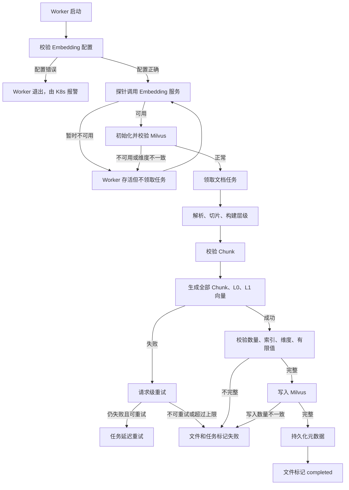

# R-04 Embedding 失败静默写入伪向量优化方案

> 状态：代码已实施，待执行数据库迁移、生产发布与历史向量重建
> 适用分支：`code-optimization`
> 方案范围：仅描述实现方案，不包含代码实现
> 关联风险：R-04、R-05、R-11、R-14

## 1. 背景与问题定义

当前 `EmbeddingEngine` 在以下情况下可能生成 SHA-256 派生的伪向量并继续处理：

- 未配置 `OPENAI_API_KEY`。
- OpenAI SDK 未安装或客户端初始化失败。
- 批量 Embedding 请求异常。
- 批量响应缺少某个 index。
- 输入文本为空。
- 结果列表中仍有未赋值项。

这些伪向量随后可能被写入 Milvus，文件仍被标记为 `completed`。由于真实向量和伪向量可能混入同一个 Collection，检索结果可能近似随机，但系统表面上仍表现为“处理成功、可以检索”。

风险并不只存在于 `_mock_embed()`：

- `MilvusStore.insert_chunks()` 会跳过非法向量，允许部分写入。
- `DocumentProcessor` 在 `vector_store=None` 时跳过写入并继续完成。
- L0/L1 写入失败只记录 warning。
- `embed_chunks()` 使用 `zip()`，长度不一致时可能静默截断。
- Milvus Collection 维度不一致时会直接删除 Collection。

因此，R-04 的修复必须同时收紧 Embedding、向量存储、文档完成条件、Worker 依赖预检、任务重试和查询失败语义。

## 2. 优化目标

最终目标是：

> 生产环境中，任何 Embedding 配置错误、服务异常、返回结果异常或向量写入不完整，都必须显式失败或进入受控重试；禁止产生伪向量，禁止部分结果被标记为成功。

完成后应满足：

1. 生产代码不存在可到达的 mock Embedding 路径。
2. Embedding 结果数量、index、维度和数值全部经过强校验。
3. 任一向量失败时拒绝整个批次，不允许补向量或跳过坏向量。
4. Worker 在必要依赖不可用时不领取任务。
5. 可恢复错误进入延迟重试，不可恢复错误明确失败。
6. 文件只有在全部必要索引写入完整后才能标记为 `completed`。
7. 查询端返回明确的 422、502 或 503，不伪装为空结果。
8. 维度不匹配时禁止自动删除 Collection。

## 3. 基本假设与实施边界

### 3.1 基本假设

- Embedding 服务通过 OpenAI 兼容接口提供，包括 LiteLLM 或内部模型网关。
- Milvus Chunk 向量是知识库检索的必要产物，不能作为可选依赖。
- `OPENRAG_RETRIEVAL_USE_L0_L1=true` 时，L0/L1 向量也是必要产物。
- Elasticsearch 仍属于可选增强，不纳入 R-04 的强成功条件。
- R-03 的 Worker 认证可以先实施；R-04 的任务重试语义不依赖 R-03，但最终状态更新应通过 R-03 认证后的 Broker 接口完成。

### 3.2 与 R-05 的边界

R-04 负责：

- 删除伪向量。
- 校验 Embedding 完整性。
- 防止部分写入被视为成功。
- 增加依赖预检、失败重试和明确错误状态。
- 遇到维度不匹配时拒绝运行，禁止自动删除集合。

R-05 负责：

- Collection 版本化。
- 新旧索引并行构建。
- Alias 原子切换。
- 旧索引保留与回滚。
- 历史索引全量重建。

因此，R-04 可以做到“发现错误后停止”，但不能单独实现跨 PostgreSQL、Milvus、MinIO、Elasticsearch 的完整原子事务。

## 4. 优化后的整体流程



## 5. 分步骤实施方案

### 步骤一：统一 Embedding 配置并建立启动校验

#### 具体目的

解决配置来源分散、参数缺少约束以及缺少 API Key 时自动进入 mock 的问题。

#### 采用方案

以 `openrag/src/openrag/config.py` 中的 `EmbeddingConfig` 作为唯一配置定义。配置优先级统一为：

```text
构造函数显式参数 > EmbeddingConfig > 环境变量默认值
```

`EmbeddingEngine` 实例创建后，不再在不同方法中动态读取环境变量。配置校验分为：

- 本地配置错误：立即失败。
- 外部服务暂时不可用：由 Worker 探针处理。

#### 涉及修改/新增的函数

修改：

- `EmbeddingConfig`
- `EmbeddingEngine.__init__()`
- `EmbeddingEngine.dimension`

新增：

- `validate_embedding_config(config: EmbeddingConfig) -> None`
- `initialize_embedding_dependency() -> EmbeddingEngine`

停止使用：

- `EmbeddingEngine.dimension` 中每次动态读取 `EMBEDDING_DIMENSION` 的逻辑。
- `EmbeddingEngine` 内部分散的 `os.environ.get(...)`。

#### 涉及修改/新增的字段

`EmbeddingConfig` 建议定义：

| 字段 | 环境变量 | 默认值 | 校验 |
|---|---|---:|---|
| `provider` | `EMBEDDING_PROVIDER` | `openai` | 当前只允许 `openai` |
| `model` | `EMBEDDING_MODEL` | 无生产默认 | 非空 |
| `api_key` | `OPENAI_API_KEY` | `None` | 生产实例化时必须非空 |
| `base_url` | `OPENAI_BASE_URL` | `None` | 可选 |
| `dimension` | `EMBEDDING_DIMENSION` | 无生产默认 | 大于 0 |
| `batch_size` | `EMBEDDING_BATCH_SIZE` | `8` | 1～2048 |
| `request_timeout_seconds` | `EMBEDDING_TIMEOUT_SECONDS` | `60` | 1～600 |
| `max_attempts` | `EMBEDDING_MAX_ATTEMPTS` | `3` | 1～5 |
| `probe_interval_seconds` | `EMBEDDING_PROBE_INTERVAL_SECONDS` | `30` | 5～300 |

建议将 `api_key` 改为 Pydantic `SecretStr`，防止配置对象被打印时泄漏。

数据库字段：无。

#### 当前步骤验证

- 没有 API Key 且没有注入测试客户端时，`EmbeddingEngine()` 明确抛出配置异常。
- 模型名称为空时启动失败。
- 维度为 0、负数或非数字时启动失败。
- `batch_size=0`、`max_attempts=0` 时配置校验失败。
- 配置创建后修改环境变量，不影响已有 Engine 的模型和维度。
- 日志和异常中不出现 API Key。

### 步骤二：建立统一异常类型和错误编码

#### 具体目的

让 Worker、查询 API 和任务系统能够区分配置错误、输入错误、服务暂时不可用、鉴权错误以及供应商非法响应，从而决定是否重试以及返回什么状态码。

#### 采用方案

在 Embedding 模块中建立最小异常体系：

```text
EmbeddingError
├── EmbeddingConfigurationError
├── EmbeddingInputError
├── EmbeddingProviderError
└── EmbeddingResponseError
```

#### 涉及修改/新增的函数和类

新增类：

- `EmbeddingError`
- `EmbeddingConfigurationError`
- `EmbeddingInputError`
- `EmbeddingProviderError`
- `EmbeddingResponseError`

新增辅助函数：

- `_classify_provider_error(exc) -> EmbeddingError`
- `_public_embedding_error(exc) -> str`

`_public_embedding_error()` 只返回可展示的稳定信息，不能包含 API Key、请求正文、原始响应正文、完整内部 Base URL 或堆栈。

#### 涉及修改/新增的字段

`EmbeddingError` 建议包含：

| 字段 | 作用 |
|---|---|
| `code` | 稳定错误码 |
| `retryable` | 是否允许任务自动重试 |
| `status_code` | 供应商 HTTP 状态码 |
| `request_id` | 供应商请求 ID |
| `retry_after_seconds` | 供应商建议等待时间 |
| `public_message` | 可返回给用户的脱敏信息 |

建议错误码：

```text
EMBEDDING_CONFIG_INVALID
EMBEDDING_INPUT_INVALID
EMBEDDING_TIMEOUT
EMBEDDING_RATE_LIMITED
EMBEDDING_PROVIDER_UNAVAILABLE
EMBEDDING_AUTH_FAILED
EMBEDDING_REQUEST_REJECTED
EMBEDDING_RESPONSE_INVALID
EMBEDDING_DIMENSION_MISMATCH
```

数据库字段：无。

#### 当前步骤验证

- 连接超时映射为 `EMBEDDING_TIMEOUT`，且 `retryable=true`。
- 429 映射为 `EMBEDDING_RATE_LIMITED`，且 `retryable=true`。
- 500、502、503 映射为 `EMBEDDING_PROVIDER_UNAVAILABLE`。
- 401、403 映射为 `EMBEDDING_AUTH_FAILED`，且不可重试。
- 400、404、422 映射为 `EMBEDDING_REQUEST_REJECTED`，且不可重试。
- 非法响应映射为 `EMBEDDING_RESPONSE_INVALID`。
- `public_message` 中不包含内部响应正文和密钥。

### 步骤三：彻底删除生产伪向量并建立强结果校验

#### 具体目的

直接消除无 Key、API 请求失败、响应缺项或空文本时生成 SHA-256 伪向量的风险，同时阻止 `zip()` 静默截断。

#### 采用方案

将 `EmbeddingEngine` 改成严格契约：

```text
输入合法 + 供应商返回完整 + 向量全部合法
                  ↓
              返回结果

任何一项不满足
                  ↓
               抛异常
```

测试使用显式注入的 Fake OpenAI Client，不在生产模块中保留 mock 模式。

#### 涉及修改/新增的函数

修改：

- `EmbeddingEngine.__init__()`
- `embed_text()`
- `embed_batch()`
- `embed_chunks()`
- `_embed_batch()`
- `_cache_key()`

删除：

- `_mock_embed()`
- 所有 `falling back to mock` 分支。

建议删除 `_embed_single()` 的独立供应商调用逻辑，改为：

```text
embed_text(text) → embed_batch([text])[0]
```

新增：

- `_validate_texts(texts) -> None`
- `_validate_embedding(vector, expected_dimension) -> list[float]`
- `_validate_response(response_data, expected_count) -> list[list[float]]`
- `_request_embeddings(texts) -> list[list[float]]`
- `probe() -> dict`

#### 强校验规则

输入侧：

- `embed_batch([])` 可以返回 `[]`。
- 文本不能为 `None`、空字符串或纯空白。
- `embed_chunks()` 中 Chunk 数量必须大于 0。
- Chunk ID 必须非空且唯一。

响应侧：

- 返回数量必须等于请求数量。
- `index` 必须唯一并完整覆盖 `0..N-1`。
- 供应商乱序返回时必须按 index 重排。
- 每个向量必须是数字数组，且不能将 `bool` 当作数字。
- 所有数值必须通过 `math.isfinite()`。
- 维度必须严格等于配置维度。
- 向量范数不能为 0 或接近 0。
- 整个批次校验完成后才能写入缓存。

`embed_chunks()` 在执行 `zip()` 前必须检查：

```text
len(chunks) == len(embeddings)
```

#### 涉及修改/新增的字段

缓存键从：

```text
model + text
```

调整为：

```text
provider + base_url + model + dimension + text
```

缓存值建议保存为不可变 tuple，返回时转换为 list，防止调用方修改缓存中的向量。

数据库字段：无。

#### 当前步骤验证

- 没有 API Key 不会生成向量。
- 供应商抛异常不会生成向量。
- 空白文本被拒绝。
- 返回数量不足、重复 index、越界 index 时整个批次失败。
- 乱序响应能够正确恢复顺序。
- 维度错误、`NaN`、`Infinity`、全零向量时失败。
- `embed_chunks()` 不允许通过 `zip()` 截断。
- 失败批次不会向缓存写入部分结果。
- 项目生产代码中不存在 `_mock_embed` 和 `falling back to mock`。

### 步骤四：实现受控的请求级重试

#### 具体目的

删除伪向量后，短暂网络抖动或 429 不应立即让整个文档任务失败；同时必须避免 SDK 重试、业务重试和任务重试叠加。

#### 采用方案

只保留一层请求级重试：

- OpenAI SDK：`max_retries=0`。
- OpenRag：最多 3 次尝试。
- 请求超时：显式设置为 60 秒。

建议退避：

| 尝试 | 默认等待 |
|---|---:|
| 第一次失败后 | 约 1 秒并加入随机抖动 |
| 第二次失败后 | 约 2 秒并加入随机抖动 |
| 第三次失败后 | 不再请求 |

如果供应商返回 `Retry-After`，优先采用，但最大等待不超过 30 秒。

只重试连接错误、超时、408、409、429 和 5xx。不重试配置错误、输入错误、400、401、403、404、422，以及数量、index、维度或数值异常。

#### 涉及修改/新增的函数

修改：

- `EmbeddingEngine.__init__()`：初始化 OpenAI Client 时传入 `max_retries=0` 和显式超时。

新增：

- `_request_embeddings()`
- `_is_retryable_provider_error()`
- `_calculate_retry_delay()`
- `_extract_retry_after()`

不建议为三次重试单独引入新的依赖或复杂重试框架。

#### 涉及修改/新增的字段

使用步骤一新增的：

- `request_timeout_seconds`
- `max_attempts`

异常中写入：

- `retry_after_seconds`
- `request_id`
- `status_code`

数据库字段：无。

#### 当前步骤验证

- 超时、429、500 后实际调用 3 次。
- 401、400、非法维度只调用 1 次。
- `Retry-After=5` 时采用 5 秒。
- `Retry-After=120` 时最多采用 30 秒。
- 测试通过 Mock 等待函数，不能真实 sleep。
- SDK 的 `max_retries` 已关闭，不存在嵌套重试。

### 步骤五：在任何向量写入前完成全部 Embedding

#### 具体目的

当前 L0/L1 Embedding 在 `MilvusLayerStore.upsert_file_layers()` 删除旧数据之后逐条生成。服务故障可能导致旧数据已经删除、新数据未写入。本步骤确保所有 Embedding 错误都发生在任何向量删除之前。

#### 采用方案

在 `DocumentProcessor` 中统一预生成：

- 全部 Chunk 向量。
- 非空 L0 向量。
- 非空 L1 向量。

全部生成并校验完成后，才进入 Milvus 写入阶段。`MilvusLayerStore` 不再负责调用 Embedding 服务，只接收已经校验完成的向量。

#### 涉及修改/新增的函数

修改：

- `DocumentProcessor.__init__()`
- `DocumentProcessor.process_document()`
- `MilvusLayerStore.upsert_file_layers()`
- `propagate_parent_directory_hierarchies()`

新增：

- `_validate_chunks(chunks) -> None`
- `_build_layer_embeddings(hierarchy_result) -> list[tuple]`
- `_assert_embedding_contract(...) -> None`

`MilvusLayerStore.upsert_file_layers()` 由：

```python
upsert_file_layers(file_id, l0_text, l1_text, embed_text)
```

调整为：

```python
upsert_file_layers(file_id, layer_embeddings)
```

其中 `layer_embeddings` 的元素包含 `layer`、`text` 和 `embedding`。

#### 涉及修改/新增的字段

`DocumentProcessor.__init__()` 建议新增：

- `require_layer_vectors: bool`

约束：

- `vector_store` 始终必填。
- `require_layer_vectors=true` 时，`layer_store` 必填。
- `require_layer_vectors=false` 时允许 `layer_store=None`。

局部计数字段：

- `expected_chunk_vectors`
- `expected_layer_vectors`
- `generated_chunk_vectors`
- `generated_layer_vectors`

数据库字段：无。

#### 当前步骤验证

- Chunk、L0 或 L1 Embedding 失败时，Milvus 删除函数都没有被调用。
- L0/L1 功能关闭时不生成 Layer 向量。
- L0/L1 功能开启且 Layer Store 不存在时立即失败。
- 非空层级文本数量和生成向量数量严格一致。

### 步骤六：收紧 Milvus 写入契约

#### 具体目的

解决 `insert_chunks()` 跳过非法向量、允许部分写入，以及维度不匹配时直接删除整个 Collection 的问题。

#### 采用方案

Chunk 和 Layer Store 均采用“批次全有或全拒绝”的输入契约：

1. 调用 Milvus 前校验整个批次。
2. 任意一条不合法，拒绝整个批次。
3. 检查 Milvus `MutationResult.insert_count`。
4. 实际写入数必须等于预期写入数。
5. 维度不一致时抛异常，禁止自动 `drop()`。

#### 涉及修改/新增的函数

修改：

- `MilvusStore._ensure_collection()`
- `MilvusStore.insert_chunks()`
- `MilvusLayerStore._ensure_collection()`
- `MilvusLayerStore.upsert_file_layers()`

新增：

- `_validate_chunk_embeddings()`
- `_assert_insert_count(expected, mutation_result)`
- `VectorSchemaMismatchError`
- `VectorWriteIncompleteError`

#### 涉及修改/新增的字段

R-04 中不扩展 Milvus Collection 字段，避免触发存量 Collection 重建。

当：

```text
existing_dimension != configured_dimension
```

行为从删除并重建 Collection 改为抛出 `VectorSchemaMismatchError`。

数据库字段：无。

#### 当前步骤验证

- 一个坏向量导致整个 `insert_chunks()` 失败。
- 不再出现跳过坏向量后返回部分成功。
- `MutationResult.insert_count` 小于预期时抛异常。
- Layer 写入数小于预期时抛异常。
- 空批次不能被视为成功写入。
- 维度不一致时原 Collection 仍然存在。
- 测试确认 `Collection.drop()` 从未被调用。
- 输入校验失败时 Milvus `insert()` 从未被调用。

### 步骤七：收紧文档 `completed` 的成功条件

#### 具体目的

防止 `vector_store=None`、Embedding 数量不足、Milvus 部分写入、L0/L1 写入失败或 DocumentChunk 元数据缺失时，文件仍被标记为 `completed`。

#### 采用方案

文件进入 `completed` 前执行统一完成门禁：

```text
chunk_count > 0
chunk_embedding_count == chunk_count
milvus_chunk_insert_count == chunk_count
document_chunk_metadata_count == chunk_count
```

启用 L0/L1 时还必须满足：

```text
layer_embedding_count == expected_layer_count
milvus_layer_insert_count == expected_layer_count
```

只有全部成立，才能更新：

```text
processing_status = completed
processing_error = null
```

#### 涉及修改/新增的函数

修改：

- `DocumentProcessor.process_document()`
- `TaskWorker._mark_file_failed()`

新增：

- `_assert_processing_complete(...) -> None`
- `TaskWorker._mark_file_pending_for_retry()`
- `TaskWorker._sanitize_processing_error()`

行为调整：

- `vector_store is None` 从跳过改为抛异常。
- 缺少 `chunk_id` 从跳过改为在向量生成前失败。
- Layer Store 异常不再只打印 warning。
- 写入数量不一致时不更新 `completed`。

#### 涉及修改/新增的字段

文件表不新增字段，继续使用：

- `processing_status`
- `processing_error`
- `total_chunks`
- `total_tokens`

`processing_error` 建议保存：

```text
ERROR_CODE: 脱敏后的公开错误信息
```

例如：

```text
EMBEDDING_PROVIDER_UNAVAILABLE: Embedding service temporarily unavailable
```

#### 当前步骤验证

- `vector_store=None` 时文件不能 completed。
- Chunk 数量、Embedding 数量、Milvus 写入数或元数据写入数任一不一致时失败。
- L0/L1 开启但 Layer Store 写入不完整时失败。
- 所有必要计数相等时才能 completed。
- 失败后 `processing_error` 包含稳定错误码。
- `processing_error` 不包含 API Key、内部响应正文或堆栈。

父目录传播暂不纳入当前文件的核心完成门禁。父目录传播失败应记录明确 Trace 和待重试状态，不能生成伪向量；将其改成独立可靠任务更适合在分层知识库专项中实施。

### 步骤八：增加 Worker 依赖预检，故障期间不领取任务

#### 具体目的

防止 Embedding 服务整体故障时，多个 Worker 持续领取任务，造成大量任务快速失败并消耗重试次数。

#### 采用方案

Worker 在领取任务前检查：

- Embedding 配置合法。
- Embedding 探针成功且维度正确。
- Milvus Chunk Collection 可连接且维度正确。
- 启用 L0/L1 时，Layer Collection 可连接且维度正确。

错误处理：

- 配置错误：Worker 退出，由 K8s 暴露 CrashLoop。
- 服务暂时不可用：Worker 保持运行，但不调用 `_pull_one_task()`。
- 每隔 30 秒重新探测。
- 探测成功后恢复领取任务。
- 任务执行中遇到 Embedding Provider 故障后，将依赖状态重新标记为 unavailable。

#### 涉及修改/新增的函数

修改：

- `TaskWorker.__init__()`
- `TaskWorker.start()`
- `TaskWorker._process_document()`
- `_create_vector_store()`
- `_create_layer_store()`

新增：

- `_initialize_processing_dependencies()`
- `_preflight_processing_dependencies()`
- `_ensure_processing_dependencies_ready()`
- `_invalidate_embedding_readiness()`

调整函数签名：

```python
_create_vector_store(embedding_engine)
_create_layer_store(embedding_engine, required)
```

上述两个函数不再捕获所有异常后返回 `None`。解析器、Chunk Engine、Embedding Engine 和 Store 建议每个 Worker 进程初始化一次，不再每个任务重新初始化。

#### 涉及修改/新增的字段

`TaskWorker` 新增进程内字段：

- `self.embedding_engine`
- `self.vector_store`
- `self.layer_store`
- `self.parser_registry`
- `self.chunk_engine`
- `self.hierarchy_storage`
- `self.dependencies_ready`
- `self.next_dependency_probe_at`

部署配置修改：

- K8s `OPENAI_API_KEY.secretKeyRef.optional` 改为 `false`。
- `01-secret.example.yaml` 不再使用空字符串示例。
- ConfigMap 增加超时、批次、尝试次数和探针间隔。
- Docker Compose 使用 `${OPENAI_API_KEY:?OPENAI_API_KEY is required}`，不允许空默认值。

#### 当前步骤验证

- 缺少 API Key 时 Worker 进程退出。
- Provider 连接失败时 Worker 不退出，但不会请求 `/broker/get-tasks`。
- Provider 恢复后 Worker自动开始领取任务。
- 探针返回错误维度或 Milvus 不可用时不领取任务。
- L0/L1 关闭时 Layer Store 不影响 Worker 就绪。
- L0/L1 开启时 Layer Store 不可用，Worker 不领取任务。

### 步骤九：实现任务级延迟重试

#### 具体目的

请求级重试只能处理秒级故障。Embedding 网关故障几分钟时，应把任务重新放回队列，而不是立即永久失败或无延迟反复执行。

#### 采用方案

采用两层重试：

```text
请求级：约 1 秒、2 秒，最多 3 次请求
任务级：30 秒、120 秒、300 秒，最多 3 次重新调度
```

`max_retries=3` 的语义统一为：初始执行不计入 `retry_count`，最多重新调度 3 次，总计最多执行 4 轮文档任务。

任务等待重试期间：

- Task 状态为 `retry`。
- File 状态回到 `pending`。
- Worker 和 heartbeat 归属清空。
- 到达 `next_retry_at` 后 Broker 才能重新分配。

#### 涉及修改/新增的函数

修改：

- `TaskService.update_task_status()`
- `TaskService.retry_task()`
- `TaskBroker._calculate_dynamic_quotas()`
- `TaskBroker._assign_tasks()`
- `TaskWorker._execute_task()`
- `TaskWorker._update_task_status()`
- `Task.to_dict()`
- `task_to_response()`

新增：

- `TaskService.schedule_task_retry(...)`
- `TaskBroker._ready_task_filter()`
- `TaskWorker._handle_task_failure(...)`
- `TaskWorker._task_retry_delay(retry_count)`

`_ready_task_filter()` 应匹配：

```text
status = pending
或
status = retry 且 next_retry_at <= 当前数据库时间
```

#### 涉及修改/新增的数据库字段

`tasks` 表新增：

| 字段 | 类型 | 用途 |
|---|---|---|
| `error_code` | `VARCHAR(64) NULL` | 稳定错误分类 |
| `error_retryable` | `BOOLEAN NOT NULL DEFAULT false` | 是否可自动重试 |
| `next_retry_at` | `TIMESTAMP NULL` | 下次允许领取时间 |

新增索引：

```text
(status, next_retry_at, priority, created_at)
```

同时需要新增 Alembic 迁移、更新 `CURRENT_MODEL_SCHEMA_DDL.md`、Task API 响应模型和 Broker Task 响应。

进入 `retry` 时：

- `retry_count += 1`
- 设置 `next_retry_at`
- `worker_id = null`
- `assigned_at = null`
- `heartbeat_at = null`
- `completed_at = null`
- `progress = 0`

成功时清空：

- `error`
- `error_code`
- `error_retryable`
- `next_retry_at`

#### 当前步骤验证

- 未到 `next_retry_at` 的任务不会被 Broker 领取。
- 到达时间后能够被领取。
- 只有 retryable 异常自动进入 retry。
- 401、配置错误、维度错误直接 failure。
- 429、超时、5xx 进入 retry。
- 第三次重试后再次失败，进入最终 failure。
- retry 状态下 File 为 pending，最终失败时 File 为 failed。
- 成功后旧错误字段全部清空。
- 两个 Worker 并发领取到期重试任务时，只能有一个领取成功。

### 步骤十：收紧查询 API 的失败语义

#### 具体目的

查询端不能把 Embedding 失败表现为 500 原始异常、空结果、自动退化为 BM25，或在 Hierarchical Store 不可用时静默变成普通平面检索。

#### 采用方案

查询参数先做空白校验，再根据异常类型返回稳定错误：

| 场景 | HTTP | 错误码 |
|---|---:|---|
| 空字符串或纯空白 | 422 | `embedding_input_invalid` |
| Provider 超时、429、5xx | 503 | `embedding_service_unavailable` |
| API Key 或配置错误 | 503 | `embedding_configuration_error` |
| Provider 返回非法向量 | 502 | `embedding_response_invalid` |
| Milvus 不可用 | 503 | `vector_database_unavailable` |
| 请求分层检索但 Layer Store 不可用 | 503 | `hierarchical_index_unavailable` |

响应示例：

```json
{
  "detail": {
    "code": "embedding_service_unavailable",
    "message": "Semantic search is temporarily unavailable"
  }
}
```

禁止返回 `str(exc)`。

#### 涉及修改/新增的函数

修改：

- `SearchRequest`
- `_get_embedding_engine()`
- `_get_layer_store()`
- `_execute_search()`
- `semantic_search()`
- `hierarchical_search()`
- `RetrievalService._embed_query()`

新增：

- `SearchRequest.validate_query()`，使用 Pydantic V2 `field_validator`。
- `_embedding_error_to_http_exception()`

删除或调整：

- `_layer_store_init_failed` 的永久失败缓存。
- Layer Store 临时初始化失败后，应允许后续重新尝试。

#### 涉及修改/新增的字段

`SearchRequest.query` 去除首尾空白，去除后为空则返回 422。

HTTP 响应增加结构化错误字段：

- `detail.code`
- `detail.message`

数据库字段：无。

#### 当前步骤验证

- 纯空白查询返回 422，且不调用 Embedding。
- Provider 超时返回 503，非法响应返回 502。
- 响应中不包含原始 Base URL、API Key 或供应商正文。
- Embedding 失败不会返回 `200 + []`。
- Embedding 失败不会自动执行 BM25。
- 显式请求分层检索但 Layer Store 不可用时返回 503。
- 普通平面检索不要求 Layer Store。

### 步骤十一：完善 Trace、日志和健康状态

#### 具体目的

确保生产环境能够判断故障类型、影响模型和批次、重试情况，以及是否出现文件完成但向量数量不一致。

#### 采用方案

优先复用现有 Trace 和结构化日志，不在 R-04 中额外引入 Prometheus 客户端依赖。

日志事件建议统一为：

```text
embedding_request_success
embedding_request_retry
embedding_request_failure
embedding_probe_success
embedding_probe_failure
embedding_validation_failure
vector_write_incomplete
document_embedding_failed
```

禁止记录原文查询和 API Key。

#### 涉及修改/新增的函数

修改：

- `EmbeddingEngine._request_embeddings()`
- `EmbeddingEngine.probe()`
- `DocumentProcessor.process_document()`
- `RetrievalService._embed_query()`
- `TaskWorker._preflight_processing_dependencies()`
- `health_check()`

新增：

- `EmbeddingEngine.health_snapshot()`

#### 涉及修改/新增的字段

Embedding Trace 建议记录：

- `provider`
- `model`
- `expected_dimension`
- `actual_dimension`
- `input_count`
- `batch_size`
- `batch_count`
- `attempt`
- `latency_ms`
- `status_code`
- `request_id`
- `error_code`
- `retryable`

`embedding.chunks` 当前 `batch_count` 固定为 1，应改为：

```text
ceil(chunk_count / embedding_batch_size)
```

进程内健康状态：

- `last_success_at`
- `last_failure_at`
- `last_probe_at`
- `last_error_code`
- `ready`

K8s liveness 不能直接依赖外部 Embedding 服务，否则供应商故障会导致 API Pod 不断重启。健康响应可以显示依赖状态，但临时 Provider 故障不能令 liveness 失败。

#### 当前步骤验证

- 成功请求可查到 provider、model、dimension 和 latency。
- 重试日志包含 attempt 和 error_code。
- 日志不包含原始文本和 API Key。
- Trace 能区分请求失败、响应校验失败和向量写入失败。
- `batch_count` 与实际请求次数一致。
- Provider 故障不会导致 K8s liveness 重启循环。
- 能通过日志查询所有 `VECTOR_WRITE_INCOMPLETE` 事件。

## 6. 测试调整计划

### 6.1 `test_embedding_engine.py`

当前大量测试依赖“没有 API Key 就生成确定性 mock”，需要改成显式 Fake Client。

保留批量拆分、缓存、模型维度和 Chunk 配对测试；删除默认实例自动 mock、不同模型产生不同 SHA-256 向量、缓存返回相同 list 对象等测试依赖。

### 6.2 新增 `test_embedding_fail_closed.py`

覆盖：

- 配置错误。
- Provider 异常。
- 数量、index、维度、NaN、Infinity、零向量。
- 请求级重试次数。
- `Retry-After`。
- 不可重试错误。
- 失败批次不写缓存。

### 6.3 新增 `test_vector_write_contract.py`

覆盖：

- Milvus 不允许跳过坏向量。
- Chunk 和 Layer 写入数必须一致。
- 维度不匹配不允许 drop Collection。

### 6.4 修改 `test_integration_document_processing.py`

覆盖：

- Vector Store 必填。
- L0/L1 开启时 Layer Store 必填。
- 任一数量不一致时文件不能 completed。
- 所有计数一致才 completed。

### 6.5 新增 `test_worker_embedding_preflight.py`

覆盖：

- 配置错误退出。
- Provider 故障不领取任务。
- Provider 恢复后恢复领取。
- 任务执行中 Provider 故障后重新进入预检。

### 6.6 修改 `test_task_management.py`

覆盖：

- 延迟重试字段。
- 到期前不可领取、到期后可领取。
- 重试上限。
- 并发领取安全。

### 6.7 修改 `test_search_api.py`

覆盖：

- 纯空白查询。
- 502、503 映射。
- 不泄漏原始异常。
- 不返回伪空结果。
- 分层索引不可用时不静默退化。

### 6.8 新增部署配置测试

建议新增 `test_embedding_deployment_config.py`，检查：

- K8s API 和 Worker 注入相同模型及维度。
- `OPENAI_API_KEY` 不是 optional。
- Docker Compose 不允许空 Key。
- API 与 Worker 的模型、维度、批次和超时配置一致。

## 7. 实施与发布顺序

### 第一阶段：建立安全回滚基线

先完成：

- 删除 `_mock_embed()`。
- 无 Key 明确失败。
- Embedding 异常明确失败。
- 不允许部分向量完成。
- 维度不匹配不允许删除 Collection。

这个版本应单独形成可部署版本，作为后续阶段的安全回滚点。后续如果重试或调度功能出现问题，只能回滚到这个 Fail Closed 基线，不能回滚到重新生成伪向量的版本。

### 第二阶段：完整稳定性能力

实施：

- 强响应校验。
- 请求级重试。
- Worker 预检。
- 任务级延迟重试。
- 查询错误映射。
- Trace 和日志。

### 第三阶段：K8s 发布

建议顺序：

1. 确认内网 Embedding 网关可访问。
2. 验证模型名称和向量维度。
3. 补齐 `openrag-secrets`。
4. 执行任务表新增字段的 Alembic 迁移。
5. 部署 API。
6. 停止旧 Worker。
7. 使用 `Recreate` 或先缩容再启动新 Worker，避免新旧 Worker 重叠。
8. 验证 Worker 探针成功。
9. 上传测试文件并验证完整计数。
10. 恢复正常任务流量。

Worker 必须先停止旧实例再启动新实例，因为旧 Worker 在滚动窗口内仍可能写入伪向量。

### 第四阶段：处理历史污染

当前 Collection 中可能混有真实向量和 SHA-256 伪向量，无法可靠区分。因此：

- 不使用向量分布猜测哪些是伪向量。
- 不进行局部启发式删除。
- 配合 R-05 创建新版本 Collection。
- 使用真实模型全量重建 Chunk、L0、L1。
- 验证文件数、Chunk 数、向量数、模型和维度。
- 通过 Alias 切换。
- 观察稳定后清理旧 Collection。

## 8. 最终验收标准

R-04 代码实施完成需要满足：

- 生产代码不存在可到达的 mock Embedding 路径。
- 缺少 API Key 不会产生任何向量。
- Provider 异常不会产生任何替代向量。
- Embedding 数量、index、维度和有限值全部正确。
- Embedding 失败发生在任何向量删除之前。
- Milvus 不允许跳过坏向量。
- Milvus 写入数量必须等于预期数量。
- 维度不一致不会删除 Collection。
- `vector_store=None` 时文件不能 completed。
- L0/L1 开启但写入失败时文件不能 completed。
- Provider 故障期间 Worker 不领取新任务。
- 可恢复错误进入延迟重试，不可恢复错误直接失败。
- 查询端返回明确的 422、502 或 503。
- 用户响应中不暴露供应商原始异常。
- 所有测试使用显式 Fake Client，不依赖生产 mock。

风险完全关闭还需要满足：

- 使用真实 Embedding 模型重建全部历史 Chunk、L0、L1 向量。
- 通过 R-05 的版本化索引完成新旧 Collection 切换。
- 确认线上不再查询可能被伪向量污染的旧 Collection。

本方案遵循最小闭环原则，将 R-04 聚焦在“禁止造假、禁止部分成功、故障可见且可恢复”；Collection 版本化和原子切换明确留给 R-05。

## 9. 代码实施结论（2026-07-15）

| 步骤 | 实施结论 |
|---|---|
| 一 | `EmbeddingConfig` 已成为统一配置入口，模型、维度、批次、超时、尝试次数和探针间隔均在 Engine 初始化时固化并校验；API Key 使用 `SecretStr`。 |
| 二 | 已建立稳定的 Embedding 异常、错误码、重试属性和脱敏公开信息。 |
| 三 | 生产 `_mock_embed` 及所有 fallback 路径已删除；输入、数量、index、维度、有限值、零向量和 Chunk 配对执行强校验。 |
| 四 | OpenAI SDK 重试已关闭，OpenRag 仅对可恢复请求执行最多三次带抖动退避，并支持上限 30 秒的 `Retry-After`。 |
| 五 | Chunk、L0、L1 Embedding 在任何 Milvus 删除前全部生成并通过数量校验；Layer Store 不再调用 Embedding。 |
| 六 | Chunk/Layer 写入改为整批校验，核对 `insert_count`；维度不匹配抛出异常，不再删除 Collection。 |
| 七 | `completed` 前核对 Chunk、Embedding、Milvus、DocumentChunk 和必要 Layer 数量；缺少 Vector Store 或必要 Layer Store 时立即失败。 |
| 八 | Worker 启动时初始化依赖；配置错误退出，Provider/Milvus 暂时不可用时暂停领取并定期探测恢复。K8s/Compose 已改为密钥必填并统一参数。 |
| 九 | `tasks` 已增加 `error_code`、`error_retryable`、`next_retry_at` 及就绪索引；实现 30/120/300 秒任务级延迟重试和到期领取。迁移版本为 `20260715_0007`。 |
| 十 | 查询空白输入返回 422；Embedding 非法响应返回 502；配置、Provider、Milvus和分层索引不可用返回结构化 503；显式分层检索不再降级。 |
| 十一 | 已增加 Embedding 请求、重试、探针、校验和文档失败日志；Trace 使用稳定错误码；健康响应展示进程内依赖快照，但不把外部 Provider 故障作为 liveness 失败。 |

专项测试覆盖配置、Fake Client、响应校验、重试、缓存、Milvus 写入契约、文档完成门禁、Worker 预检、任务延迟重试、查询错误映射和部署配置。代码实施不包含 R-05 Collection 版本化，也不代表历史伪向量已经清理；生产发布前必须先执行 Alembic 迁移并验证真实 Embedding/Milvus 依赖。
