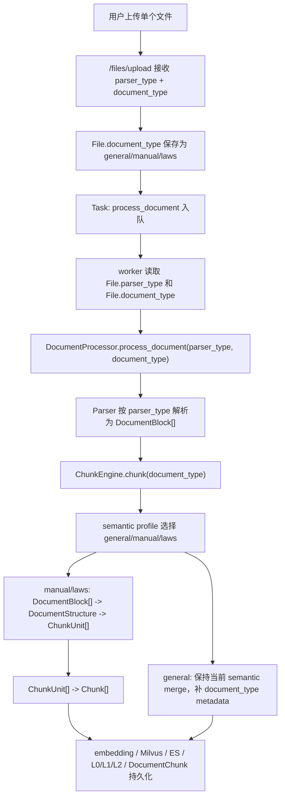

# DocumentStructure + document_type Implementation Plan

> **For agentic workers:** REQUIRED SUB-SKILL: Use superpowers:subagent-driven-development (recommended) or superpowers:executing-plans to implement this plan task-by-task. Steps use checkbox (`- [ ]`) syntax for tracking.

**Goal:** 在 OpenRag 中接入文件级 `document_type`，让 `general`、`manual`、`laws` 在默认 semantic chunk 策略下使用不同的文档结构组织方式。

**Architecture:** 保留当前 `parser_type -> DocumentBlock[] -> Chunk[] -> embedding/L0/L1/L2` 主链路，在 `DocumentBlock[]` 和 `Chunk[]` 之间新增临时 `DocumentStructure`。`document_type` 不替代 `parser_type`，只作为 semantic 内部 profile 的选择条件。第一阶段不改 service-token documents 接口，不新增工作区默认值，不让 `DocumentStructure` 落库。

**Tech Stack:** FastAPI, SQLAlchemy, Alembic, Pydantic, pytest, React, Ant Design, Vitest.

---

## 0. 范围和假设

- `document_type` 是用户上传或重新处理单个文件时手动选择的内容类型，合法值固定为 `general`、`manual`、`laws`。
- 默认值是 `general`。历史文件、service-token documents 上传、目录记录都使用 `general`，但目录不会参与分块。
- 本阶段只改 `/files/upload`、`/files/{file_id}/reprocess`、worker、`DocumentProcessor`、`ChunkEngine` 和前端上传/重处理入口。
- `/service/v1/.../documents` 暂不暴露 `document_type` 参数，但它通过 `ingest_new_file()` 默认值继续生成 `general` 文件。
- `general` 需要尽量保持当前 semantic 行为；`manual/laws` 才引入新的结构组织和 chunk 合并规则。
- 新增的 `DocumentStructure` 是 chunk 前临时结构，不新增数据库表，不改变最终 `DocumentChunk` 表的核心字段。
- 现有 L0/L1/L2 是 chunk 后的检索层级，不与本计划的 `DocumentStructure` 混用。

## 1. 文件结构总览

计划新建：

- `openrag/src/openrag/chunking/document_type.py`
  - 统一保存 `SUPPORTED_DOCUMENT_TYPES`、`DEFAULT_DOCUMENT_TYPE`、`normalize_document_type()`。
- `openrag/src/openrag/chunking/document_structure.py`
  - 定义 `DocumentItem`、`StructureNode`、`ChunkUnit`、`DocumentStructure`。
  - 提供标题栈、block 包装、section path、bbox/page/source block 汇总等通用能力。
- `openrag/src/openrag/chunking/document_sectionizer.py`
  - 提供 `build_document_structure()`。
  - 内部实现 `general`、`manual`、`laws` 三种 sectionizer。
  - 包含 manual 标题/步骤/Q&A 识别、laws 编号体系选择、目录清理、`tree_merge(depth=2)` 的第一版实现。
- `openrag/src/openrag/chunking/document_profile_chunker.py`
  - 将 `DocumentStructure` 转成 semantic 可以消费的 profile items。
  - 实现 manual 和 laws 的 chunk unit 合并规则。
- `openrag/alembic/versions/20260602_0003_add_file_document_type.py`
  - 给 `files` 表新增 `document_type` 字段。

计划修改：

- `openrag/src/openrag/models/file.py`
- `openrag/src/openrag/services/file_ingest.py`
- `openrag/src/openrag/api/files_api.py`
- `openrag/src/openrag/worker/task_worker.py`
- `openrag/src/openrag/processors/document_processor.py`
- `openrag/src/openrag/chunking/chunk_engine.py`
- `openrag/src/openrag/chunking/ragflow_core/semantic.py`
- `web/src/types/index.ts`
- `web/src/services/api.ts`
- `web/src/components/FileUpload.tsx`
- `web/src/components/FileList.tsx`
- `web/src/i18n/locales/zh.json`
- `web/src/i18n/locales/en.json`

计划新增或修改测试：

- `openrag/tests/test_files_api.py`
- `openrag/tests/test_chunk_engine.py`
- `openrag/tests/test_document_structure.py`
- `openrag/tests/test_document_type_pipeline.py`
- `web/src/services/api.test.ts`
- `web/src/components/FileList.test.tsx`
- 可选：`web/src/components/FileUpload.test.tsx`

## 2. 整体链路



## 3. 执行步骤

### Step 1: 增加 document_type 基础常量、数据库字段和模型字段

**实现内容**

- 新建统一常量和校验模块。
- 在 `files` 表增加 `document_type` 字段。
- 在 SQLAlchemy `File` 模型增加 `document_type`。
- 在 API 响应模型中返回 `document_type`。

**解决的问题**

- 当前系统没有保存“文档内容类型”的地方，worker 无法知道用户选择了 `general`、`manual` 还是 `laws`。
- 如果只把 `document_type` 放在请求参数里，不落库，重试、worker 异步处理、重新处理都会丢失该值。

**修改文件**

- 新建：`openrag/src/openrag/chunking/document_type.py`
- 新建：`openrag/alembic/versions/20260602_0003_add_file_document_type.py`
- 修改：`openrag/src/openrag/models/file.py`
- 修改：`openrag/src/openrag/api/files_api.py`
- 修改：`web/src/types/index.ts`

**新建字段/功能**

- `File.document_type: str`
- `FileResponse.document_type: str`
- `SUPPORTED_DOCUMENT_TYPES = ("general", "manual", "laws")`
- `DEFAULT_DOCUMENT_TYPE = "general"`
- `normalize_document_type(value: str | None) -> str`

**建议实现**

`document_type.py` 保持简单：

```python
SUPPORTED_DOCUMENT_TYPES = ("general", "manual", "laws")
DEFAULT_DOCUMENT_TYPE = "general"


def normalize_document_type(value: str | None) -> str:
    normalized = (value or DEFAULT_DOCUMENT_TYPE).strip().lower()
    if normalized not in SUPPORTED_DOCUMENT_TYPES:
        raise ValueError(
            f"Invalid document_type. Supported types: {', '.join(SUPPORTED_DOCUMENT_TYPES)}"
        )
    return normalized
```

Alembic migration：

```python
def upgrade() -> None:
    op.add_column(
        "files",
        sa.Column(
            "document_type",
            sa.String(length=32),
            nullable=False,
            server_default="general",
            comment="User selected document content type: general/manual/laws",
        ),
    )
    op.alter_column("files", "document_type", server_default=None)


def downgrade() -> None:
    op.drop_column("files", "document_type")
```

**预期结果**

- 新文件默认 `document_type="general"`。
- 历史文件迁移后也有 `general`。
- API 返回的文件对象包含 `document_type`。
- 目录记录也会有 `general`，但目录不会进入处理链路。

**验证**

- 运行迁移或至少运行 migration 单测环境：
  - `cd openrag`
  - `python -m pytest tests/test_files_api.py -q`
- 增加并验证：
  - `_file_to_response()` 返回 `document_type`。
  - 新建 `FileModel` 时未显式传入 `document_type` 也能得到 `general`。

### Step 2: 接入 /files/upload 的 document_type 参数

**实现内容**

- `/files/upload` 新增 form 参数 `document_type`，默认 `general`。
- `ingest_new_file()` 新增关键字参数 `document_type`，默认 `general`。
- 上传时校验 `document_type`，非法值返回 400。
- 创建 `FileModel` 时保存 `document_type`。

**解决的问题**

- 用户需要在上传每个文件时单独选择内容类型。
- 当前上传只保存 `parser_type`，无法保存 manual/laws 分块策略所需的文件级选择。

**修改文件**

- 修改：`openrag/src/openrag/api/files_api.py`
- 修改：`openrag/src/openrag/services/file_ingest.py`
- 修改：`openrag/tests/test_files_api.py`

**新建字段/功能**

- `/files/upload` form 字段：`document_type: str = Form(default="general")`
- `ingest_new_file(..., document_type: str = DEFAULT_DOCUMENT_TYPE)`

**预期结果**

- 不传 `document_type` 上传时，文件记录保存 `general`。
- 传 `manual` 或 `laws` 上传时，文件记录保存对应值。
- 传非法值，例如 `finance`，上传接口返回 400。
- `/service/v1/.../documents` 不增加新入参，但因为 `ingest_new_file()` 有默认值，service 上传文件会保存为 `general`。

**验证**

- 增加后端测试：
  - `test_upload_defaults_document_type_to_general`
  - `test_upload_accepts_manual_document_type`
  - `test_upload_rejects_invalid_document_type`
- 运行：
  - `cd openrag`
  - `python -m pytest tests/test_files_api.py -q`

### Step 3: 接入 /files/{file_id}/reprocess 的 document_type 参数

**实现内容**

- `ReprocessRequest` 新增可选字段 `document_type`。
- 不传 `document_type` 时保留文件原值。
- 传入 `document_type` 时更新 `File.document_type`，然后清理旧 chunk/vector 并重新排队。
- 非法 `document_type` 返回 400。

**解决的问题**

- 用户重新处理文件时可能需要把原来的 `general` 改为 `manual` 或 `laws`。
- 如果 reprocess 只改 `parser_type`，旧的 document_type 会固定不变，无法重新按内容类型分块。

**修改文件**

- 修改：`openrag/src/openrag/api/files_api.py`
- 修改：`openrag/tests/test_files_api.py`
- 修改：`web/src/services/api.ts`
- 修改：`web/src/components/FileList.tsx`

**新建字段/功能**

- `ReprocessRequest.document_type: Optional[str]`
- `filesAPI.reprocess(id, parserType?, documentType?)`
- 前端重处理表单增加 `document_type` 选择框。

**预期结果**

- `POST /files/{file_id}/reprocess` 请求体 `{}` 时，保留原 `document_type`。
- 请求体 `{"document_type": "laws"}` 时，文件记录更新为 `laws` 并重新入队。
- 请求体 `{"document_type": "unknown"}` 时返回 400。
- 前端重处理弹窗中可选择 `general/manual/laws`。

**验证**

- 后端：
  - `cd openrag`
  - `python -m pytest tests/test_files_api.py -q`
- 前端：
  - `cd web`
  - `npm test -- FileList.test.tsx`
- 关键断言：
  - reprocess 不传时，`file.document_type` 不变。
  - reprocess 传 `manual/laws` 时，`file.document_type` 被更新。
  - `filesAPI.reprocess(1, "pdf", "manual")` 发送 `{ parser_type: "pdf", document_type: "manual" }`。

### Step 4: worker、DocumentProcessor、ChunkEngine 透传 document_type

**实现内容**

- worker 从 `File.document_type` 读取内容类型。
- `DocumentProcessor.process_document()` 增加 `document_type` 参数。
- `ChunkEngine.chunk()` 和 `_chunk_semantic()` 增加 `document_type` 参数。
- `chunk_semantic_ragflow()` 增加 `document_type` 参数。
- trace 的 `chunk.build` 输入摘要增加 `document_type`。
- `process_document()` 返回结果增加 `document_type`。

**解决的问题**

- 即使数据库保存了 `document_type`，如果 worker 和 chunk engine 不透传，分块阶段仍然无法感知该值。
- 当前 `chunk_method` 虽然被解析出来，但在 semantic 里被 `_ = chunk_method` 忽略；新逻辑必须显式依赖 `document_type`。

**修改文件**

- 修改：`openrag/src/openrag/worker/task_worker.py`
- 修改：`openrag/src/openrag/processors/document_processor.py`
- 修改：`openrag/src/openrag/chunking/chunk_engine.py`
- 修改：`openrag/src/openrag/chunking/ragflow_core/semantic.py`
- 新增或修改：`openrag/tests/test_document_type_pipeline.py`

**新建字段/功能**

- `DocumentProcessor.process_document(..., document_type: str = DEFAULT_DOCUMENT_TYPE)`
- `ChunkEngine.chunk(..., document_type: str = DEFAULT_DOCUMENT_TYPE)`
- `chunk_semantic_ragflow(..., document_type: str = DEFAULT_DOCUMENT_TYPE)`

**预期结果**

- worker 日志和 trace 能看到 `document_type`。
- chunk metadata 至少包含 `document_type`。
- 在还没有实现 manual/laws profile 前，传入不同 `document_type` 不应破坏现有 chunk 行为。

**验证**

- 增加轻量单测，mock `ChunkEngine.chunk()`，确认 `DocumentProcessor` 把 `document_type` 传进去。
- 增加 worker 单测或局部测试，mock `DocumentProcessor.process_document()`，确认 worker 从 `File.document_type` 读取并传入。
- 运行：
  - `cd openrag`
  - `python -m pytest tests/test_document_type_pipeline.py -q`

### Step 5: 前端上传和重处理入口增加 document_type 选择

**实现内容**

- 上传组件新增 `documentType` state，默认 `general`。
- 上传表单新增“文档内容类型”选择框，选项为 `general/manual/laws`。
- 上传请求把 `document_type` 放入 `FormData`。
- 重处理弹窗新增 `document_type` 表单项，默认使用当前文件的 `document_type`，没有值时为 `general`。
- 文件类型定义中增加 `document_type`。
- 中英文 i18n 增加字段和选项文案。

**解决的问题**

- 用户需要在每个文件上传时选择文档内容类型。
- 重新处理时需要能切换类型。
- 前端类型如果不加字段，后端返回 `document_type` 后无法稳定使用。

**修改文件**

- 修改：`web/src/components/FileUpload.tsx`
- 修改：`web/src/components/FileList.tsx`
- 修改：`web/src/services/api.ts`
- 修改：`web/src/types/index.ts`
- 修改：`web/src/i18n/locales/zh.json`
- 修改：`web/src/i18n/locales/en.json`
- 修改：`web/src/services/api.test.ts`
- 修改：`web/src/components/FileList.test.tsx`
- 可选新增：`web/src/components/FileUpload.test.tsx`

**新建字段/功能**

- TypeScript 类型：
  - `export type DocumentType = 'general' | 'manual' | 'laws'`
  - `File.document_type?: DocumentType`
- API：
  - `filesAPI.upload(file, parserType, workspaceId, path, documentType)`
  - `filesAPI.reprocess(id, parserType, documentType)`

**预期结果**

- 上传时默认发送 `document_type=general`。
- 用户选择 manual/laws 后上传请求携带对应值。
- 重处理弹窗会显示当前文件已有类型，用户可切换。
- 不改变 `multiple: false`，仍然一次上传一个文件。

**验证**

- 运行：
  - `cd web`
  - `npm test -- api.test.ts FileList.test.tsx`
- 手动检查：
  - `FileUpload.tsx` 仍是 `multiple: false`。
  - 上传成功后 `documentType` reset 为 `general`。
  - 重处理提交时 body 包含 `document_type`。

### Step 6: 新增 DocumentStructure 临时结构层

**实现内容**

- 将 `DocumentBlock[]` 包装为有稳定 id、block 引用和结构归属的 `DocumentItem[]`。
- 用 `StructureNode` 表达 `root/section/paragraph/table/image/article/clause` 等节点。
- 用 `parent_id/children` 表达层级关系。
- 用 `ChunkUnit` 表达“准备进入 semantic merge 的语义单元”，它不是最终 `Chunk`。

**解决的问题**

- 当前 semantic 直接把 `DocumentBlock` 文本串起来，heading/level 只作为 owner metadata 偶然进入 chunk。
- 需要一个 chunk 前结构层，让标题、条款、表格、图片能够有稳定归属。

**修改文件**

- 新建：`openrag/src/openrag/chunking/document_structure.py`
- 新增测试：`openrag/tests/test_document_structure.py`

**新建字段/功能**

- `DocumentItem`
  - `item_id`
  - `block`
  - `text`
  - `block_type`
  - `level`
  - `page`
  - `bbox`
  - `metadata`
- `StructureNode`
  - `node_id`
  - `node_type`
  - `title`
  - `level`
  - `parent_id`
  - `children`
  - `item_ids`
  - `metadata`
- `ChunkUnit`
  - `text`
  - `unit_type`
  - `source_items`
  - `source_blocks`
  - `section_path`
  - `section_level`
  - `metadata`
- `DocumentStructure`
  - `items`
  - `nodes`
  - `root_id`
  - `item_to_node`
  - `node_path(node_id)`
  - `node_source_blocks(node_id)`

**预期结果**

- `DocumentStructure` 可以表达：
  - 标题节点下面有哪些段落、表格、图片。
  - laws 的章/节/条/款层级。
  - manual 的 section、步骤、Q&A、表格图片归属。
- 它不影响数据库，不改变最终 `Chunk` 数据模型。

**验证**

- 增加并运行：
  - `cd openrag`
  - `python -m pytest tests/test_document_structure.py -q`
- 关键断言：
  - 一个 `DocumentBlock` 会被包装成一个 `DocumentItem`。
  - `StructureNode.children` 能表达父子关系。
  - `DocumentStructure.node_path()` 返回从根到当前 section 的标题路径。

### Step 7: 实现标题栈 sectionizer，组织 DOC/DOCX/MD 已有 heading/level

**实现内容**

- 在 `document_sectionizer.py` 中实现通用 heading stack。
- 遇到 `block_type="heading"` 且 `level=N` 的 block 时：
  - 弹出栈中所有 `level >= N` 的 section。
  - 把当前 heading 挂到剩余栈顶。
  - 当前 heading 入栈。
- 普通正文、表格、图片挂到当前栈顶。

**解决的问题**

- DOC/DOCX 和 Markdown parser 已经能产生 `heading/level`，但当前 chunk 阶段没有稳定消费它。
- heading stack 能明确表达“标题开始一个 section，遇到同级或更高级标题结束当前 section”。

**修改文件**

- 新建：`openrag/src/openrag/chunking/document_sectionizer.py`
- 修改：`openrag/tests/test_document_structure.py`

**新建字段/功能**

- `build_document_structure(blocks, document_type) -> DocumentStructure`
- `_build_heading_stack_structure(blocks) -> DocumentStructure`
- `_is_heading_block(block) -> bool`

**标题层级组织示例**

输入：

```text
1 安装说明      level=1 heading
环境要求说明     text
1.1 安装步骤    level=2 heading
下载安装包       text
1.2 卸载说明    level=2 heading
卸载正文         text
2 常见问题      level=1 heading
问题正文         text
```

结构：

```text
root
  section: 1 安装说明
    paragraph: 环境要求说明
    section: 1.1 安装步骤
      paragraph: 下载安装包
    section: 1.2 卸载说明
      paragraph: 卸载正文
  section: 2 常见问题
    paragraph: 问题正文
```

**预期结果**

- DOC/DOCX/MD 中已有 heading 不再只是 metadata，而是 chunk 前结构边界。
- 标题和下属正文、表格、图片有稳定归属。
- 同级标题之间不会被错误挂成父子关系。

**验证**

- 测试：
  - `H1 -> text -> H2 -> text -> H1 -> text`
  - 预期：第二个 H1 是 root 的另一个子 section，不是第一个 H1 的子节点。
- 运行：
  - `cd openrag`
  - `python -m pytest tests/test_document_structure.py::test_heading_stack_builds_nested_sections -q`

### Step 8: 实现 PDF 和普通文本的 manual sectionizer

**实现内容**

- 在没有可靠 `heading/level` 的 PDF/text block 上，用文本和 layout 信号推断 manual section。
- 识别 manual 中常见的标题、步骤、Q&A、短冒号标题。
- 将标题、下属说明、步骤、Q&A、表格、图片组织到同一个 manual section。
- 为每个 manual section 分配 `sec_id`。

**解决的问题**

- 当前 PDF parser 通常输出 `block_type="text"`、`level=0`，不会天然产生 manual 的章节结构。
- 只在 chunk 阶段用长度切割，无法稳定形成“标题 + 下属说明 + 操作步骤”的完整语义单元。

**修改文件**

- 修改：`openrag/src/openrag/chunking/document_sectionizer.py`
- 修改：`openrag/tests/test_document_structure.py`

**新建字段/功能**

- `_build_manual_structure(blocks) -> DocumentStructure`
- `_detect_manual_heading_level(text, block) -> int | None`
- `_is_manual_step(text) -> bool`
- `_is_manual_question(text) -> bool`
- `_assign_manual_sec_ids(structure) -> None`

**manual 标题识别规则第一版**

- 优先使用 parser 已有 `block_type="heading"` 和 `level`。
- 其次使用 `block.layout_type in {"title", "head", "heading"}`。
- 再使用文本规则：
  - 数字章节：`1 安装`、`1.1 下载`、`2.3.1 配置`
  - 中文章节：`第一章`、`第一节`
  - 短冒号标题：`安装前准备：`
  - Q&A：`Q: 如何重置密码？`、`问：如何重置密码？`
- 步骤编号如 `步骤一`、`Step 1`、`1)`、`（1）` 默认归入当前 section，不单独提升为顶级 section。

**manual sec_id 规则**

- sectionizer 先得到 section level。
- 主要标题层级变化时开启新的 `sec_id`。
- 普通正文、步骤、Q&A answer、表格、图片沿用当前 `sec_id`。
- 第一版不强行复刻 RAGFlow 的所有 `title_frequency()` 细节，只实现可测试、可解释的规则。

**预期结果**

- manual 文档中，安装说明、步骤、Q&A 和相关表格图片能组成结构组。
- 如果结构信号不足，回退为顺序 paragraph，不破坏普通文档。

**验证**

- 测试 fixture：

```text
2 安装步骤
安装前请确认系统环境满足要求。
2.1 下载安装包
从官网下载对应版本安装包。
2.2 解压并运行
解压后执行 install.sh。
[table]
```

- 断言：
  - `2 安装步骤` 是 section。
  - 说明、`2.1`、`2.2`、表格都能得到 section path。
  - 表格归属到最近的 manual section。
- 运行：
  - `cd openrag`
  - `python -m pytest tests/test_document_structure.py::test_manual_structure_groups_steps_and_table -q`

### Step 9: 实现 laws sectionizer 和 tree_merge(depth=2)

**实现内容**

- 对 laws 文档进行目录清理、冒号标题拆分、编号体系选择、层级识别和树合并。
- 实现 RAGFlow laws 的核心思想：
  - `bullets_category()` 给整篇文档选择一套主编号体系。
  - 用编号体系计算章、节、条、款、项等 level。
  - `tree_merge(depth=2)` 使用当前文档实际出现的第二个 distinct level 作为目标 chunk 组织深度。
  - 更深层内容并入所属上级结构片段。

**解决的问题**

- laws 不能只按长度切割，否则会把“章/节/条/款”的法规结构打散。
- laws 的核心 chunk 边界应来自法规层级，而不是 parser 文件格式。

**修改文件**

- 修改：`openrag/src/openrag/chunking/document_sectionizer.py`
- 修改：`openrag/tests/test_document_structure.py`

**新建字段/功能**

- `_build_laws_structure(blocks) -> DocumentStructure`
- `_remove_contents_table(items) -> list[DocumentItem]`
- `_make_colon_as_title(items) -> list[DocumentItem]`
- `_select_bullet_category(texts) -> str | None`
- `_law_level_for_text(text, category) -> int | None`
- `_tree_merge_law_units(structure, depth=2) -> list[ChunkUnit]`

**laws 编号体系第一版**

- 中文法规型：
  - `第一章`
  - `第一节`
  - `第一条`
  - `（一）`
  - `1.`
- 数字层级型：
  - `1`
  - `1.1`
  - `1.1.1`
- Markdown 标题型：
  - `#`
  - `##`
  - `###`
- 英文法规/手册型可先覆盖：
  - `PART`
  - `Chapter`
  - `Section`
  - `Article`

**tree_merge(depth=2) 示例**

输入：

```text
第一章 总则
第一条 为规范公司档案管理，制定本办法。
（一）本办法适用于总部及分支机构。
（二）档案管理应遵循完整、准确、安全原则。
第二条 档案管理部门负责制度解释。
第二章 归档要求
第三条 各部门应按月提交归档材料。
```

实际出现 level 为 `[1, 3, 4]`，`depth=2` 的目标 level 是 `3`，也就是“条”。

输出 unit：

```text
unit_1 =
  第一章 总则
  第一条 为规范公司档案管理，制定本办法。
  （一）本办法适用于总部及分支机构。
  （二）档案管理应遵循完整、准确、安全原则。

unit_2 =
  第一章 总则
  第二条 档案管理部门负责制度解释。

unit_3 =
  第二章 归档要求
  第三条 各部门应按月提交归档材料。
```

**预期结果**

- laws chunk unit 不跨法规结构片段合并。
- 深层款、项会并入所属“条”或实际第二层目标结构。
- 目录段不会被当作正文 chunk。

**验证**

- 测试：
  - `test_laws_selects_chinese_bullet_category`
  - `test_laws_tree_merge_depth_uses_second_distinct_level`
  - `test_laws_removes_contents_table`
- 运行：
  - `cd openrag`
  - `python -m pytest tests/test_document_structure.py::test_laws_tree_merge_depth_uses_second_distinct_level -q`

### Step 10: 将 DocumentStructure 转成 semantic profile items

**实现内容**

- 新建 `document_profile_chunker.py`。
- 把 manual/laws 的 `DocumentStructure` 转成 semantic 内部可消费的 item。
- item 需要包含文本、类型、来源 blocks、section path、section level、node type、document_type。
- general 暂时保持现有 semantic merge，只补 metadata，不重写边界。

**解决的问题**

- `DocumentStructure` 只是结构层，最终还需要变成 `Chunk[]`。
- 当前 semantic 的最终 chunk 生成逻辑已经负责 position metadata、tokenize fields、bbox union，应该尽量复用，避免重复实现。

**修改文件**

- 新建：`openrag/src/openrag/chunking/document_profile_chunker.py`
- 修改：`openrag/src/openrag/chunking/ragflow_core/semantic.py`
- 修改：`openrag/tests/test_chunk_engine.py`

**新建字段/功能**

- `build_profile_items(blocks, document_type, chunk_size, min_chunk_tokens) -> list[dict] | None`
- `build_manual_profile_items(structure, chunk_size) -> list[dict]`
- `build_laws_profile_items(structure, chunk_size) -> list[dict]`
- `split_unit_inside_boundary(unit, chunk_size) -> list[ChunkUnit]`

**profile item 格式**

```python
{
    "text": "...",
    "ck_type": "text" | "table" | "image",
    "image": None,
    "source_blocks": [...],
    "document_type": "manual",
    "section_path": ["2 安装步骤", "2.1 下载安装包"],
    "section_level": 2,
    "structure_node_type": "section",
    "sec_id": 1,
}
```

**预期结果**

- manual/laws 能绕过原来的 naive text-only merge，改用结构 unit。
- semantic 最终仍输出当前 `Chunk` dataclass。
- position metadata、`content_with_weight`、`content_ltks`、`page_num_int` 等现有 metadata 继续存在。

**验证**

- 测试：
  - manual profile item 包含 `section_path` 和 `sec_id`。
  - laws profile item 一一对应 tree_merge 输出。
  - general 调用路径不生成 profile items，现有 chunk 行为保持。
- 运行：
  - `cd openrag`
  - `python -m pytest tests/test_chunk_engine.py -q`

### Step 11: 实现 manual chunk 合并规则

**实现内容**

- manual 使用 RAGFlow manual 的合并思想。
- chunk unit 先按页面、纵向坐标、横向坐标排序。
- 同一 `sec_id` 内，在 token 门槛内合并。
- 短 chunk 强制并入上一 chunk。
- 表格和图片优先并入所属 section 的上下文。

**解决的问题**

- manual 文档需要把“标题 + 下属说明 + 操作步骤 + 表格/图片上下文”作为完整语义单元。
- 不能简单按长度切，否则步骤和说明容易分离。

**修改文件**

- 修改：`openrag/src/openrag/chunking/document_profile_chunker.py`
- 修改：`openrag/src/openrag/chunking/ragflow_core/semantic.py`
- 修改：`openrag/tests/test_chunk_engine.py`

**新建字段/功能**

- `_merge_manual_units(units, chunk_size) -> list[ChunkUnit]`
- `_unit_token_count(unit) -> int`
- `_unit_sort_key(unit) -> tuple`

**manual 合并规则**

- 如果上一 chunk 累计 token `< 32`，当前 unit 直接并入上一 chunk，不检查 `sec_id`。
- 否则，如果上一 chunk 累计 token `< 1024`，并且当前 unit 的 `sec_id == last_sid`，当前 unit 并入上一 chunk。
- 否则，如果当前 unit 是表格或图片，并且上一 chunk 累计 token `< 1024`，当前 unit 并入上一 chunk，同时保留 `structure_node_type=table/image` metadata。
- 其他情况新开 chunk。
- `1024` 是继续合并门槛，不是硬最大长度；一次合并可能把 chunk 从小于 1024 推到大于 1024。
- 如果单个 section 超长，只在该 section 内部分裂，不跨 section 补内容。

**标题和正文如何拼接**

- chunk text 使用 source blocks 的原始顺序拼接。
- 标题 block 如果已经是 section 的第一个 source block，不额外重复标题。
- 对于 laws 或 parser 没有把上级标题包含在正文中的情况，允许将 `section_path` 中缺失的上级标题作为文本前缀补入 chunk。
- metadata 始终写入：
  - `document_type`
  - `section_path`
  - `section_level`
  - `structure_node_type`
  - `parent_heading`

**预期结果**

- manual 的同一 section 在合理 token 范围内合并为一个 chunk。
- 跨主要 section 时新开 chunk。
- 表格/图片不会失去所属标题上下文。

**验证**

- 测试 fixture：

```text
2 安装步骤
安装前请确认系统环境满足要求。
2.1 下载安装包
从官网下载对应版本安装包。
2.2 解压并运行
解压后执行 install.sh。
```

- 断言：
  - chunk text 中同时包含标题、说明、步骤。
  - chunk metadata 中 `document_type == "manual"`。
  - chunk metadata 中 `section_path` 包含 `2 安装步骤`。
- 运行：
  - `cd openrag`
  - `python -m pytest tests/test_chunk_engine.py::TestSemanticChunking -q`

### Step 12: 实现 laws chunk 组织规则

**实现内容**

- laws 使用 `tree_merge(depth=2)` 的输出作为 chunk unit。
- 不在 tree_merge 输出之后跨相邻 unit 拼接。
- 超长 unit 只在当前法规结构片段内部拆分，拆出的子 chunk 都保留同一个 section path。
- 更深层款、项已经在 tree_merge 阶段并入所属上级。

**解决的问题**

- laws 文档的 chunk 边界应该由法规结构决定，而不是 token 累计决定。
- 如果跨条拼接，会破坏法规引用的精确性。

**修改文件**

- 修改：`openrag/src/openrag/chunking/document_profile_chunker.py`
- 修改：`openrag/src/openrag/chunking/ragflow_core/semantic.py`
- 修改：`openrag/tests/test_chunk_engine.py`

**新建字段/功能**

- `_merge_laws_units(units, chunk_size) -> list[ChunkUnit]`
- `_split_law_unit_if_needed(unit, chunk_size) -> list[ChunkUnit]`

**laws 合并规则**

- `tree_merge(depth=2)` 的每个输出片段默认生成一个 chunk。
- 不使用 manual 的 `<32` 和 `<1024` 跨组织合并规则。
- 如果一个条款片段过长，在片段内部按句子或段落拆分，所有子 chunk metadata 保留相同：
  - `section_path`
  - `law_target_level`
  - `structure_node_type="article"` 或实际目标 node type
- 表格/图片归入最近的 article/section，不跨 article 合并。

**预期结果**

- laws 输出 chunk 基本一一对应法规结构片段。
- “第一章 + 第一条 + 款项”形成一个 chunk，“第一章 + 第二条”形成另一个 chunk。
- chunk metadata 能表达法规路径。

**验证**

- 测试：
  - `第一章/第一条/（一）/第二条` 生成两个 laws chunks。
  - 第一个 chunk 包含第一章、第一条和两个款项。
  - 第二个 chunk 包含第一章和第二条，但不包含第一条款项。
- 运行：
  - `cd openrag`
  - `python -m pytest tests/test_chunk_engine.py::test_laws_chunks_do_not_cross_article_units -q`

### Step 13: 处理表格和图片的结构归属与 metadata

**实现内容**

- `DocumentItem` 保留 table/image 的原始 `DocumentBlock`。
- table/image 作为 `StructureNode` 挂到当前 section/article。
- semantic 最终生成 `Chunk` 时继续使用现有 RAGFlow-like metadata：
  - `doc_type_kwd`
  - `ragflow_chunk_type`
  - `page_num_int`
  - `position_int`
  - `top_int`
  - `content_with_weight`
- 新增结构 metadata：
  - `document_type`
  - `section_path`
  - `parent_heading`
  - `structure_node_type`

**解决的问题**

- 表格和图片如果独立成 chunk，需要知道它们属于哪个标题或法规条款。
- 如果并入文本 chunk，需要保留它们的位置信息，避免影响 PDF 定位和预览。

**修改文件**

- 修改：`openrag/src/openrag/chunking/document_structure.py`
- 修改：`openrag/src/openrag/chunking/document_profile_chunker.py`
- 修改：`openrag/src/openrag/chunking/ragflow_core/semantic.py`
- 修改：`openrag/tests/test_chunk_engine.py`

**新建字段/功能**

- `ChunkUnit.unit_type = "table" | "image"`。
- profile item 中保留 `image` 和 `source_blocks`。
- semantic finalizer 优先使用 profile item 的 `source_blocks` 计算位置；没有时回退到原来的文本反向匹配逻辑。

**表格/图片处理规则**

- general：
  - 保持当前 table/image special path。
  - 只补 `document_type=general`。
- manual：
  - table/image 归入最近 manual section。
  - 如果上一 chunk token `< 1024`，优先并入上一 chunk。
  - 如果无法并入，则单独生成 table/image chunk，并带 section path。
- laws：
  - table/image 归入最近 article/section。
  - 不跨 article 合并。
  - 过大的 table/image 可以单独成 chunk，但 metadata 必须带法规路径。

**预期结果**

- 表格和图片不会丢失所属标题上下文。
- PDF position metadata 仍可用于定位。
- 现有 table/image 测试继续通过。

**验证**

- 测试：
  - manual 中 `heading -> text -> table`，table chunk metadata 有 `section_path`。
  - laws 中 `第一条 -> table -> 第二条`，table 不进入第二条 chunk。
  - 现有 `test_semantic_docx_like_mixed_block_types` 继续通过。
- 运行：
  - `cd openrag`
  - `python -m pytest tests/test_chunk_engine.py::TestSemanticChunking -q`

### Step 14: 保持 general profile 与现有 semantic 行为兼容

**实现内容**

- `document_type="general"` 时走当前 `chunk_semantic_ragflow()` 原有 merge 逻辑。
- 不让 general 强制使用 manual/laws 的结构边界。
- 只在 metadata 中增加 `document_type="general"`。
- 如果 general 文档已有 heading/level，可以后续再补 section_path metadata，但第一版不要改变 chunk 边界。

**解决的问题**

- 接入新功能不能破坏普通文档已有分块结果。
- 用户没有选择 manual/laws 时，系统行为应和当前版本尽量一致。

**修改文件**

- 修改：`openrag/src/openrag/chunking/ragflow_core/semantic.py`
- 修改：`openrag/tests/test_chunk_engine.py`
- 修改：`openrag/tests/parity/test_chunk_semantic_parity.py`

**新建字段/功能**

- `document_type=general` metadata 注入。
- general 分支的兼容测试。

**预期结果**

- 现有 semantic chunk 测试和 parity 测试不因新功能大面积变化。
- 只有 metadata 增加 `document_type`，文本、数量、position 字段尽量保持不变。

**验证**

- 运行：
  - `cd openrag`
  - `python -m pytest tests/test_chunk_engine.py tests/parity/test_chunk_semantic_parity.py -q`
- 关键断言：
  - general chunk 数量和文本与旧逻辑一致。
  - 每个 general chunk metadata 有 `document_type="general"`。

### Step 15: 持久化和检索层兼容检查

**实现内容**

- 确认 `DocumentProcessor` 持久化 `DocumentChunk` 时不需要新增列。
- `Chunk.metadata` 中的新结构字段主要供 ES/Milvus metadata 使用。
- `DocumentChunk.block_type/level/source_block_id/source_char_start/source_char_end/page/bbox` 仍按现有逻辑写入。
- L0/L1/L2 仍消费最终 `Chunk[]`，不感知 `DocumentStructure`。

**解决的问题**

- 新结构层不能破坏后续 embedding、Milvus、ES、L0/L1/L2、DocumentChunk 存储。
- 避免把 chunk 前结构层和检索层级混在一起。

**修改文件**

- 修改：`openrag/src/openrag/processors/document_processor.py`
- 修改：`openrag/tests/test_integration_document_processing.py` 或新增 `openrag/tests/test_document_type_pipeline.py`

**新建字段/功能**

- `chunk.build` trace output 可增加：
  - `document_type`
  - `structure_profile`
  - `chunk_count`
- `process_document()` 返回：
  - `document_type`

**预期结果**

- 处理完成后 `file.total_chunks`、`DocumentChunk` 记录、L0/L1/L2 路径仍正常。
- 新增 `document_type` 不要求改 `DocumentChunk` 表。

**验证**

- 使用 fake parser + fake embedding 的处理链路测试。
- 断言：
  - `DocumentProcessor` 可以处理 `document_type="manual"`。
  - 最终 `DocumentChunk` 写入成功。
  - chunk metadata 中结构字段不会导致 DB 持久化失败。
- 运行：
  - `cd openrag`
  - `python -m pytest tests/test_document_type_pipeline.py -q`

### Step 16: 端到端回归和验收

**实现内容**

- 跑后端 API、chunk、pipeline 测试。
- 跑前端 API 和重处理弹窗测试。
- 手动验证上传和重新处理链路。

**解决的问题**

- 单元测试能覆盖局部逻辑，但需要确认从上传到 worker 到 chunk 生成的整体链路一致。

**修改文件**

- 不新增功能，仅补齐测试和必要文档说明。

**新建字段/功能**

- 可选补充文档：
  - `docs/方案缺陷.md` 后续可增加“第一阶段修复范围”小节。
  - 或新增 `docs/document_type_chunking.md` 说明用户选择项。

**预期结果**

- `general`、`manual`、`laws` 都能完成上传、入队、处理、生成 chunk。
- `manual` 的 chunk 更接近“标题 + 下属说明 + 步骤/表格图片”。
- `laws` 的 chunk 更接近“章/节路径 + 条 + 款项”。
- service-token documents 接口仍可使用，默认产生 `general`。

**验证命令**

后端：

```powershell
cd E:\project\OpenRag\openrag
python -m pytest tests/test_files_api.py tests/test_chunk_engine.py tests/test_document_structure.py tests/test_document_type_pipeline.py -q
```

前端：

```powershell
cd E:\project\OpenRag\web
npm test -- api.test.ts FileList.test.tsx
```

可选完整构建：

```powershell
cd E:\project\OpenRag\web
npm run build
```

手动验证：

- 上传文件时选择 `general`，确认返回数据和数据库记录为 `general`。
- 上传文件时选择 `manual`，确认 worker trace 中 `chunk.build.document_type=manual`。
- 上传文件时选择 `laws`，确认 chunk text 中包含法规路径，例如“第一章 总则 + 第一条 ...”。
- 对已有文件执行 reprocess，不传 `document_type` 时保留原值。
- 对已有文件执行 reprocess，传 `document_type=laws` 时更新记录并重新分块。

## 4. 分阶段交付建议

### 第一阶段交付边界

- 完成 Step 1 到 Step 16。
- `document_type` 影响 semantic 内部 profile。
- manual/laws 在 chunk 阶段消费现有 `DocumentBlock` 的文本、heading、level、layout、bbox、metadata。
- PDF parser 本身暂不因 `document_type` 切换 layout recognizer。

### 第二阶段再考虑

- 让 `document_type` 可选进入 PDF parser 层。
- manual/laws 使用更接近 RAGFlow 的 layout profile。
- 如果底层 layout recognizer 支持 domain，再评估是否自动选择 `layout.manual` 或 `layout.laws` 模型。
- 增加工作区默认 `document_type`。
- 扩展 `/service/v1/.../documents` 支持 service-token 调用方指定 `document_type`。

## 5. 成功标准

- `/files/upload` 支持 `document_type`，默认 `general`，非法值 400。
- `/files/{file_id}/reprocess` 支持可选 `document_type`，不传保留原值，传入则更新。
- worker 能把 `File.document_type` 传到 `DocumentProcessor`、`ChunkEngine`、semantic profile。
- `general` 的现有 semantic 行为基本不变。
- `manual` 能按 section、步骤、Q&A、表格/图片上下文组织 chunk。
- `laws` 能按编号体系和 `tree_merge(depth=2)` 组织 chunk，不跨法规结构片段拼接。
- 表格和图片保留现有 position metadata，并增加所属 section path。
- `DocumentStructure` 不落库，不影响 L0/L1/L2 入口。
