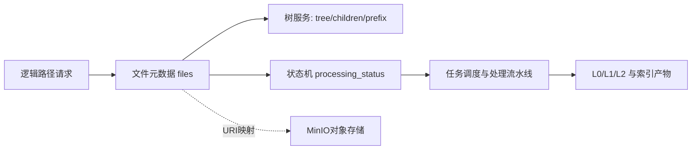
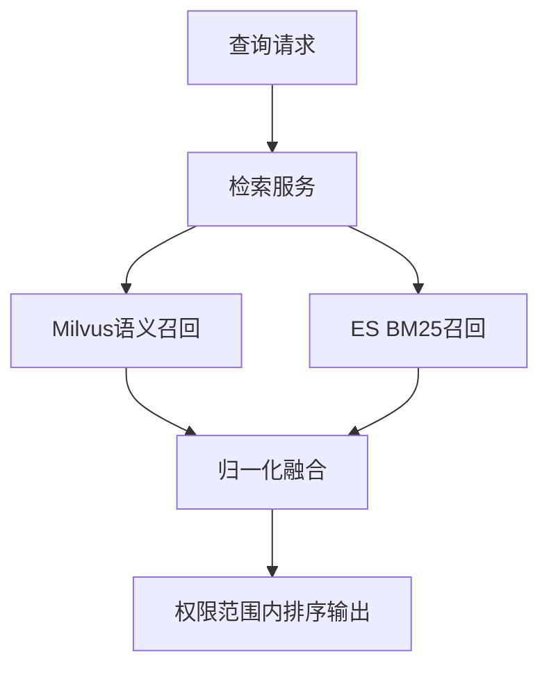
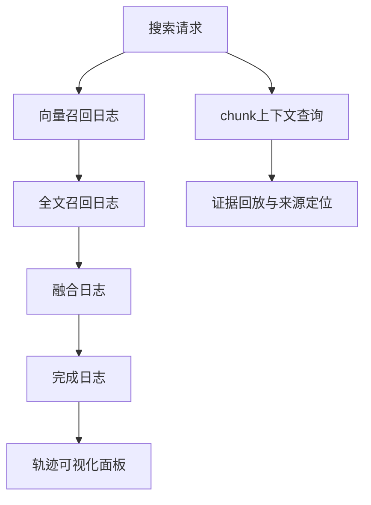
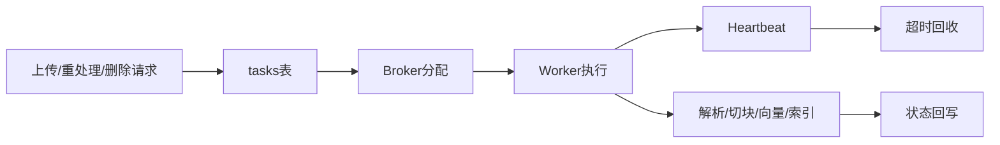
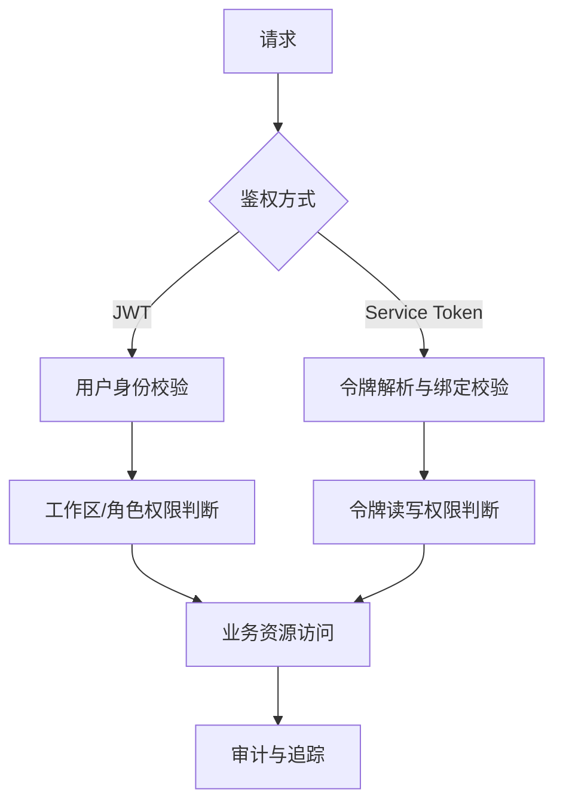

# OpenRag 六大核心理念（官方说明）

本文面向项目方案、技术评审与实施沟通场景，围绕 OpenRag 当前实现，说明六项核心理念的设计目标、工程落点与演进方向。

---

## 1. 虚拟文件系统管理

OpenRag 的虚拟文件系统以逻辑路径为核心抽象，通过元数据层与对象存储层解耦，实现统一的知识对象管理能力。在数据模型上，`files` 表以 `workspace_id + uri` 作为唯一约束，支持目录与文件统一建模（`is_directory`、`parent_id`、`child_count`），形成可维护的逻辑树结构。在存储层，文档实体以 MinIO 对象形式保存，目录可仅存在于数据库侧，从而实现“逻辑目录”与“物理对象”分离。  
该设计使系统能够在不暴露底层存储细节的前提下，提供稳定的路径管理、目录懒加载、前缀遍历、批量删除与重命名等能力。相关行为在 API 层通过路径标准化与层级判定逻辑进行统一治理，确保跨模块语义一致。同时，文件元数据中包含处理状态字段（`processing_status`）及层级产物路径（`l0_path/l1_path/l2_path`），使“文件管理”与“知识处理流水线”形成闭环。  
在工程意义上，虚拟文件系统不仅承担上传下载入口，更承担知识对象生命周期编排职责，是 OpenRag 在多工作区、多来源文档场景下实现可扩展管理的基础设施。后续可进一步将树查询能力统一收敛到专用服务接口，降低前后端重复逻辑，提升系统一致性与可维护性。

---

## 2. 混合检索

OpenRag 当前检索体系采用“向量检索 + 全文检索”融合机制，以提高召回稳定性与结果相关性。向量侧基于 Milvus 完成语义近邻召回；全文侧基于 Elasticsearch 的 BM25 完成关键词与术语匹配。系统在检索服务中实现归一化后融合，并通过 `vector_similarity_weight` 控制语义分与文本分权重，形成可配置、可调参、可退化的混合检索路径。  
在检索策略上，系统支持平面检索与上下文分层检索两种模式，并提供 `auto/light/deep/precise/flat` 策略入口。上下文模式下，流程按 L0 文件候选、L1 概览增强、L2 切片召回逐层收敛，并进行多源分数组合。该机制可在保证召回范围的同时控制噪声扩散，兼顾效率与精度。  
此外，检索前置权限过滤确保仅在可访问文件范围内进行召回，避免越权数据进入后续排序与生成链路。结合现有日志字段（向量命中、ES命中、融合结果、耗时统计），混合检索体系已具备线上调优与质量治理所需的可观测基础。后续可围绕策略自动化与权重自适应继续演进。

---

## 3. 分层上下文加载

OpenRag 在数据结构与检索流程上均已体现分层上下文加载能力。文件模型中定义 `l0_path/l1_path/l2_path`，用于承载不同层级的语义产物；处理链路在文档完成解析后写回分层路径，并可向上聚合目录层语义，形成“文档层 + 目录层”联合上下文。  
在检索执行阶段，上下文模式按“先粗后细”进行：先以 L0 层筛选候选文件，再以 L1 层增强文件级语义判断，最终在候选集合内进行 L2 切片召回与融合评分。该流程天然适配大规模知识库场景，可在有限预算下提升有效证据密度。  
系统同时提供多个可调参数（L0 候选规模、L1 深度、L2 抓取倍率）以支持不同业务负载与精度目标，并可通过切片邻接接口补充前后文片段，提升回答连贯性与可解释性。下一阶段建议引入查询意图驱动的自动预算分配，以减少人工调参成本，形成稳定的策略闭环。

---

## 4. 可视化检索轨迹

OpenRag 已具备建设检索轨迹可视化的核心条件。现有检索链路已输出结构化日志，覆盖向量召回统计、全文召回统计、融合计算结果、策略解析结果与端到端耗时等关键维度，可直接作为轨迹重建的数据来源。  
此外，检索返回中包含切片级定位信息（`chunk_id/chunk_index/page/bbox/source offsets`）及文件级关联信息（`uri/object_key/object_url`），并提供按 `chunk_id` 查询上下文与邻块的接口。这使系统能够同时支持“研发调试视角”（步骤、分数、耗时）与“业务解释视角”（答案证据来源与定位）。  
建议以“日志重放 + 证据定位”作为首期实现路径：先建立可检索请求的步骤化展示能力，再逐步引入统一 `trace_id` 串联检索与生成阶段。该路径可在不改变核心算法的情况下，快速提升系统可解释性、故障定位效率与线上调参效率。

---

## 5. 解析与任务调度

OpenRag 采用数据库内嵌 Broker + 多进程 Worker 的任务处理架构，覆盖文档上传、重处理、删除等异步操作。任务由 API 写入 `tasks` 表后，Worker 通过 `/broker/get-tasks` 拉取执行，执行期间通过 heartbeat 保活，状态回写至任务记录，实现完整的异步生命周期管理。  
调度层实现了动态权重分配与公平保底机制：对存在待处理任务的工作区保证最小配额，再按权重分配剩余额度；任务领取使用行级锁与 `SKIP LOCKED` 避免并发抢占冲突。系统还具备超时回收能力（心跳超时任务自动回退为待处理）与进程级重启机制，保障长时间运行稳定性。  
处理链路已串联解析、切块、向量写入、全文索引写入与层级产物回填，形成从“任务创建”到“可检索数据产出”的端到端闭环。后续可在现有基础上增强 SLA 观测指标（队列深度、等待时延、失败重试成功率、工作区吞吐），支撑生产环境容量规划与稳定性治理。

---

## 6. 精细化权限与令牌鉴权

OpenRag 当前已形成“用户鉴权 + 机器鉴权”双通道安全模型。用户侧基于 JWT 完成身份认证与账号状态校验；机器侧基于 `X-OpenRag-Token` 进行服务令牌校验。服务令牌采用单工作区绑定策略，并限制为 `read/write` 权限级别，避免全局密钥带来的横向越权风险。  
授权层由工作区成员权限与角色权限共同构成：`workspace_members` 提供直接权限，`user_roles + role_workspace_permissions` 提供角色继承权限，二者在业务服务中统一汇总判断。文件层面提供独立授权能力（用户/团队 + read/write/admin），可支持更细粒度的资源访问控制。  
在接口治理上，服务 API 在每个入口都执行工作区绑定与权限等级校验，读写请求按最小权限原则分离执行；令牌支持撤销（`revoked_at`）并可进行权限更新。后续建议补充令牌调用审计与异常访问告警，以增强安全追踪与合规能力。

