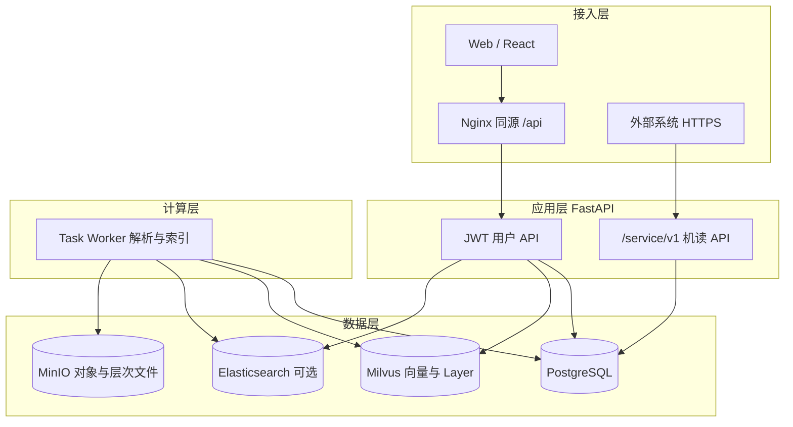

# OpenRag 项目方案与技术概述

> 本文面向**评审、对外介绍与架构对齐**：阐明建设动机、总体方案、技术栈与核心亮点。操作说明、部署步骤与 API 字段仍以 `01`～`04` 四份文档及运行态 **OpenAPI `/docs`** 为准。

---

## 一、我们在解决什么问题

企业文档 **格式杂、体量大、目录深**，朴素「切片 + 单向量检索」往往面临三类矛盾：

1. **语义相关但字面不重合** 时，仅靠关键词会漏召；仅靠稠密向量又容易在 **海量切片** 中淹没细粒度证据。  
2. 知识在组织上天然是 **树状与路径化** 的，若存储与检索脱离「目录语境」，召回会缺乏 **可解释的全局结构**。  
3. 平台既要服务 **人类协作**（权限、审计、Web 管理），又要服务 **业务系统机读**（同步、流水线、无人值守检索），需要 **两套鉴权与契约** 长期并存。

**OpenRag** 的定位是：在 **工作区（Workspace）** 边界内，提供 **逻辑文件目录 + 深度解析入库 + 分层 / 混合检索 + 双通道 API**，作为可私有化部署的企业 RAG 底座。

---

## 二、总体架构（一览）

| 层次 | 职责 |
|------|------|
| **接入** | Web 管理目录与检索；生产环境 Nginx **静态资源 + `/api` 反代**；外部系统直连或经网关访问。 |
| **应用** | 鉴权、工作区与文件元数据、**检索编排**（分层 / 混合 / 重排）、任务与 Broker、**服务令牌**管理。 |
| **数据** | PostgreSQL 为权威元数据与权限及任务状态；MinIO 存对象与层次摘要文件；Milvus 存 **L0/L1/L2**；可选 ES 存 **chunk 全文**。 |
| **计算** | Task Worker **异步解析、Embedding、写向量与 ES**；与 API 进程解耦，便于横向扩展。 |

---

## 三、关键技术方案

### 3.1 虚拟逻辑文件目录

以 **`uri`（绝对逻辑路径）** 与 **`parent_id`** 表达 **工作区内唯一一棵树**，与对象存储物理 key 解耦。同一套路径贯通 **浏览、上传、`path_prefix` 子树检索、对外 `tree/children/documents`**，便于权限裁剪与业务系统 **按路径映射**。

### 3.2 分层向量与「由粗到细」检索

- **L2**：细粒度切片向量，承担最终证据命中。  
- **L0 / L1**：文档与结构级摘要向量，目录节点由子项 **向上聚合**，使「文件夹」进入语义空间。  
- **上下文检索**：**L0 粗筛 → L1 在候选上细化 → 仅在候选文件集合内搜 L2**，多阶段 **min-max 归一化** 后按 **0.2 / 0.3 / 0.5** 加权融合；Layer 不可用时 **自动退化为平面 L2**，可用性优先。

### 3.3 混合检索（稠密 + 稀疏）

在 **Elasticsearch 开启** 时，BM25 与 Dense 在有限授权文件范围内独立召回，按 `chunk_id` 求并集并使用 **Weighted RRF** 融合名次。`vector_similarity_weight` 表示 Dense 通道贡献，原始 BM25 与向量分只用于诊断，不直接线性相加。

### 3.4 解析与任务调度

上传仅 **落库 + 创建任务**；**Task Worker** 经 **Broker** 拉取解析任务，避免 API 被重 CPU / IO 阻塞。PDF 走 **RAGFlow deepdoc** 管线，侧重 **版面、表格与位置标签** 的结构化解析。

### 3.5 权限与双通道集成

- **工作区** 硬隔离；成员、角色、单独授权构成读写矩阵。  
- **JWT**（人机）与 **`X-OpenRag-Token`**（`/service/v1` 机读）**路由与依赖链分离**，降低密钥误用与安全审计成本。

---

## 四、技术栈一览

| 类别 | 选型 |
|------|------|
| 前端 | React 18、TypeScript、Vite、Ant Design、React Router、i18next |
| 后端 | Python 3.11、FastAPI、SQLAlchemy、Alembic、Pydantic Settings |
| 关系型数据 | PostgreSQL 16 |
| 向量与分层 | Milvus 2.4.x（standalone），etcd + MinIO 为 Milvus 依赖 |
| 全文（可选） | Elasticsearch 8.x |
| 对象存储 | MinIO（S3 兼容） |
| 任务调度 | Broker API + Task Worker（HTTP 轮询，状态在 PostgreSQL） |
| 文档解析 | RAGFlow deepdoc（版面感知管线） |
| 部署 | Docker Compose；Kubernetes 要点见 [02-Kubernetes部署.md](./02-Kubernetes部署.md) |

---

## 五、核心亮点（一句话 + 六点）

**一句话**：OpenRag 将 **分层目录语境下的向量检索**、**可选全文混合与重排**、**异步解析入库** 与 **多工作区 + 双 API 通道** 封装为可私有化的企业 RAG 平台。

1. **路径即模型**：逻辑目录与检索前缀一致，集成与权限裁剪天然一致。  
2. **L0→L1→L2**：目录与文档先进入语义粗筛，再下钻切片，大库更稳、可调参。  
3. **向量 + 全文**：显式权重融合稠密与稀疏通道。  
4. **DeepDoc PDF 解析**：版面感知管线，版面、表格与位置标签的结构化解析。  
5. **`/service/v1` + 服务令牌**：机读与人机解耦，适合平台化对接。  
6. **Worker 与 Broker**：解析与在线检索解耦，便于扩缩与运维。

---

## 六、延伸阅读

| 文档 | 说明 |
|------|------|
| [01-项目说明.md](./01-项目说明.md) | 功能表、业务流程图、部署视图摘录 |
| [02-Kubernetes部署.md](./02-Kubernetes部署.md)～[04-外部系统接入与API.md](./04-外部系统接入与API.md) | 部署、使用、对外 API |
| `docs/superpowers/`、`docs/openrag-unimplemented.md` | 内部设计草案与未完成项 |
